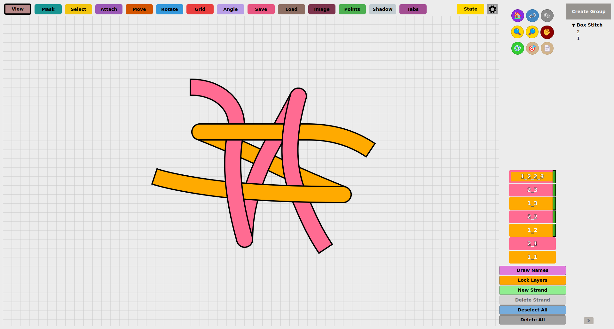

# OpenStrand Studio - Version 1.110

An advanced diagramming tool for creating tutorials involving strand manipulation (knots, hitches, etc.)
with dynamic masking that automatically adjusts the over-under effects between strands,
making complex patterns clear and easy to understand.

## What's New in Version 1.110

### ✨ New Features

- **Layer-Only Colors and Set-Wide Stroke Color**: The layer menu now pairs every color option with a layer-only version: Change Color / Change Color (This Layer Only) and Change Stroke Color / Change Stroke Color (This Layer Only), matching the existing width entries. Change Stroke Color now recolors the whole set just like Change Color, while the layer-only entries repaint only the clicked layer. Per-layer exceptions are saved with your project and survive undo/redo, tab switching and group operations; changing the set color again resets them.
- **Undo/Redo History That Says What You Did**: Every undo and redo step now records what produced it — the mode you were using, or the panel, dialog or menu entry — together with the layers it touched and when it happened. The Undo and Redo buttons name the action they will reverse or replay, and Settings → History gains a “Recorded actions” list showing this session's activity or the steps of a past session. The record travels inside each saved state, so it survives a restart, history export/import and session recovery.
- **Collapsible Group Column**: The group column on the right of the layer panel can now get out of the way. A small chevron at its bottom collapses it from 140 px to a 40 px rail, and the canvas takes the room. The rail keeps a G tile that opens the usual Create Group flow, plus one tile per group showing the first letter of its name; clicking a tile expands the column with that group in view. Ctrl+G (Cmd+G on Mac) toggles it, and the choice is remembered between sessions.

## Features

- Layer-based design with masking capability that automatically updates when strands are reordered or repositioned.
- Interactive strand manipulation 
- Group transformation tools
- Precise angle/length controls
- Grid snapping
- Multilingual (EN/FR/IT/ES/PT/HE/DE)

## Screenshots




## Usage

1. Clone the repository, best to use:
```bash
git clone --filter=blob:limit=5m https://github.com/ysetbon/OpenStrandStudio <your-desired-folder>
cd <your-desired-folder>
```

2. Install dependencies:
```bash
pip install -r requirements.txt
```

3. Run the application:
```bash
python src/main.py
```

For installer builds see `src/INSTALL_GUIDE_Windows.md` and
`src/INSTALL_GUIDE_mac.md` (macOS: one command — `bash src/build_mac_1_110.sh`).

## Video Tutorials

Find usage tutorials on the [LanYarD YouTube channel](https://www.youtube.com/@1anya7d).

## Development

- Python 3.9+
- PyQt5

## License

GNU General Public License v3.0

## Contact

Created by Yonatan Setbon
- [LinkedIn](https://www.linkedin.com/in/yonatan-setbon-4a980986/)
- [Instagram](https://www.instagram.com/ysetbon/)
- [YouTube - LanYarD](https://www.youtube.com/@1anya7d)
- Email: [ysetbon@gmail.com](mailto:ysetbon@gmail.com)

---

© 2026 OpenStrand Studio - Version 1.110
