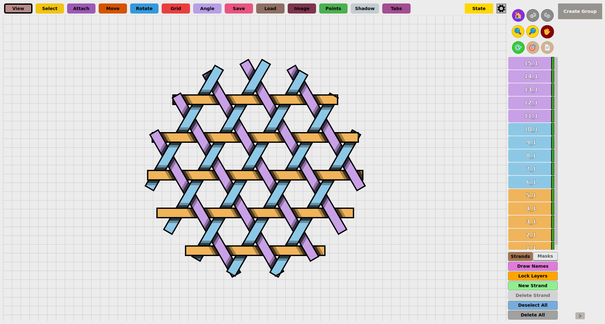

# OpenStrand Studio - Version 2.0

An advanced diagramming tool for creating tutorials involving strand manipulation (knots, hitches, etc.)
with dynamic masking that automatically adjusts the over-under effects between strands,
making complex patterns clear and easy to understand.

## What's New in Version 2.0

### ✨ New Features and Fixes

- **Strands and Masks Tabs**: The layer list is now split into two tabs, Strands and Masks, with a switch just above Draw Names. The Masks tab has its own New Mask, Delete Mask, Deselect All and Delete All buttons, and New Mask replaces the Mask button in the toolbar. Delete All on this tab removes only the masks, after a confirmation, in one undo step. Masks are now always kept above all strands, so where a mask sits in the list no longer matters, and selecting a layer from the other tab opens that tab for you.
- **Fixed Shadow Issues**: Fixed shadow issues from older versions. Shadows for masks now behave more naturally.
- **Seven New Samples**: In Settings, under Samples, you will find seven new projects to open and learn from: Straight Weave 12×12, Curved Weave 6×6, Plait, Thick and Thin, Bridge, Twisted Pairs and Kagome Weave. The sample buttons now sit two to a row, so the whole list fits on the page.

## Features

- Layer-based design with masking capability that automatically updates when strands are reordered or repositioned.
- Interactive strand manipulation 
- Group transformation tools
- Precise angle/length controls
- Grid snapping
- Multilingual (EN/FR/IT/ES/PT/HE/DE)

## Screenshots




## Usage

1. Clone the repository, best to use:
```bash
git clone --filter=blob:limit=5m https://github.com/ysetbon/OpenStrandStudio <your-desired-folder>
cd <your-desired-folder>
```

2. Install dependencies:
```bash
pip install -r requirements.txt
```

3. Run the application:
```bash
python src/main.py
```

For installer builds see `src/INSTALL_GUIDE_Windows.md` and
`src/INSTALL_GUIDE_mac.md` (macOS: one command — `bash src/build_mac_1_112.sh`).

## Video Tutorials

Find usage tutorials on the [LanYarD YouTube channel](https://www.youtube.com/@1anya7d).

## Development

- Python 3.9+
- PyQt5

## License

GNU General Public License v3.0

## Contact

Created by Yonatan Setbon
- [LinkedIn](https://www.linkedin.com/in/yonatan-setbon-4a980986/)
- [Instagram](https://www.instagram.com/ysetbon/)
- [YouTube - LanYarD](https://www.youtube.com/@1anya7d)
- Email: [ysetbon@gmail.com](mailto:ysetbon@gmail.com)

---

© 2026 OpenStrand Studio - Version 2.0
