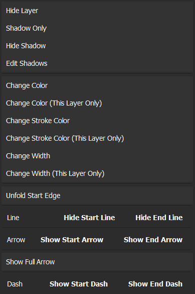
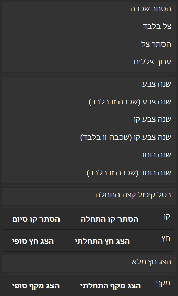

# Color / Stroke Scope Feature — Verification Screenshots

Feature branch: `worktree-color-stroke-scope` (commit `e48afdcbd`).

The layer context menu now offers **set-wide** and **"This Layer Only"** flavors of
Change Color, Change Stroke Color, and Change Width. These are live screenshots of
the real app (not mockups), captured by
[`automation_tests/capture_color_scope_menu.py`](../../automation_tests/capture_color_scope_menu.py),
which right-clicks layer `1_1` and grabs the open menu from the screen.

Run it yourself:

```
python automation_tests/capture_color_scope_menu.py en --visible
python automation_tests/capture_color_scope_menu.py he --visible
```

Besides capturing, the script asserts against the live menu widgets that all six
entries are present, each set-wide entry sits directly above its layer-only
sibling, and every label is LTR in English / RTL in Hebrew (17 checks per
language, all passing on 26 Aug 2026).

## English (LTR)

Entries left-aligned, reading left-to-right.



## Hebrew (RTL)

Same entries mirrored: text hugs the right edge, matching the layer panel's
Hebrew layout conventions from v1.109.


