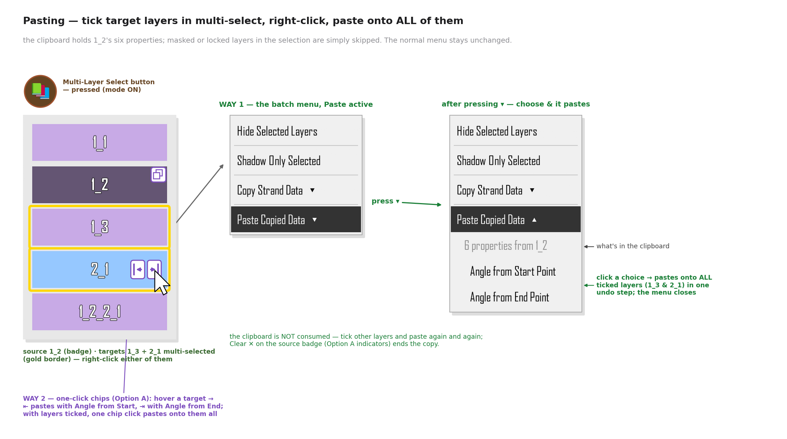
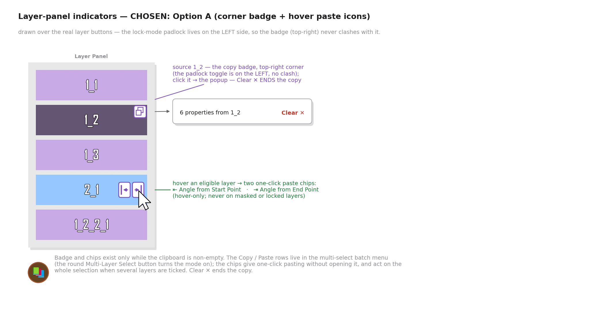
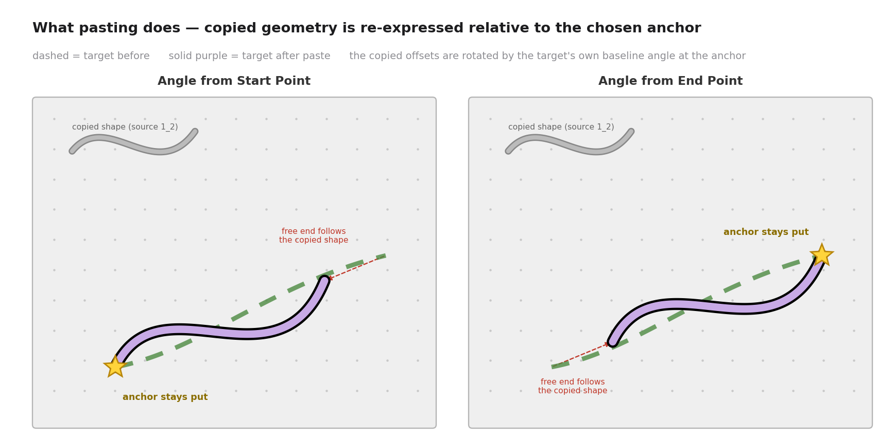

# Copy / Paste Strand Data — Product Concept

> Status: **concept only** — no application code has been changed. This folder contains the
> product spec plus mockup images (generated by the helper scripts in [`tools/`](tools/)).
>
> **The UI in the mockups is the app's real UI**: `tools/render_ui_qt.py` runs the actual
> `NumberedLayerButton.show_context_menu` code path offscreen with real `Strand` /
> `MaskedStrand` objects and screenshots the menus it builds; the proposed additions are
> built from the app's own `HoverLabel` class, exact menu stylesheet, and the same
> embedded-widget pattern as the existing Arrow Customization block. The raw UI captures
> live in [`mockups/qt/`](mockups/qt/).

## Summary

Copy/paste strand data lives in the layer panel's **multi-select mode** (entered with
the round **Multi-Layer Select** button). Right-clicking a ticked layer there already
shows the small **batch menu** — *Hide Selected Layers* / *Shadow Only Selected* — and
the proposal appends two dropdown rows to it: **Copy Strand Data ▾** and
**Paste Copied Data ▾**. The normal-mode right-click menu is completely untouched.

**Copy Strand Data ▾** lets the user pick exactly *which* pieces of the right-clicked
strand to copy — kept deliberately to the **six essentials**: Start Point, End Point,
Control Points (curve shape incl. bias), Width (incl. stroke width), Strand Color and
Stroke Color. Pressing the dropdown arrow expands the panel of toggles (with a
**Select All** master toggle) inline in the menu, in the same style as the existing
Arrow Customization panel; until then no detail toggles are visible.

After copying, **tick any number of target layers** (regular or attached strands —
masked layers are skipped), right-click one of them and expand **Paste Copied Data ▾**.
It reveals two placement choices — clicking one pastes onto **all ticked layers at
once** (a single undo step) and closes the menu, and the clipboard survives for further
pastes until the next Copy:

- **Angle from Start Point** — the copied geometry is re-anchored at the target's start
  point; every copied angle and length rides along unchanged, so the target takes the
  exact copied shape planted at its own start.
- **Angle from End Point** — same, but re-anchored at the target's end point.

Non-geometric properties (colors, widths…) are simply applied as-is. While a copy is
active, the layer panel shows it (chosen design **Option A**, end of section 3): a copy
badge on the source layer's button, hover ⇤ / ⇥ one-click paste chips on eligible
layers, and **Clear** on the badge to finish the copy.


---

## 1. What can be copied

The panel deliberately stays short — **just the six essentials**, the things you reach
for when making one strand look like another. Every toggle maps to real strand
attributes (`src/strand.py`), and the set mirrors what the app already saves to JSON
(`serialize_strand`, `src/save_load_manager.py:109`) and what group duplication already
copies in memory (`GroupPanel.copy_strand_properties`, `src/group_layers.py:3217`).


| Toggle (panel label) | Strand attributes | Geometric? |
|---|---|---|
| Start Point | `start` | yes |
| End Point | `end` | yes |
| Control Points | `control_point1`, `control_point_center` (+ `control_point_center_locked`, `triangle_has_moved`), `control_point2` (+ `control_point2_shown`, `control_point2_activated`), `bias_control.triangle_bias`, `.circle_bias`, `.triangle_position`, `.circle_position` | points yes, bias values no |
| Width | `width`, `stroke_width` | no |
| Strand Color | `color` | no |
| Stroke Color | `stroke_color` | no |

Notes:

- **Angle needs no toggle** — a strand's baseline angle is defined by its endpoints,
  and pasting re-applies it through the anchor choice (section 4). Copying Start/End
  carries the angle with it.
- **Control Points is one toggle** covering all three control points *and* the bias
  controls — users think "the curve's shape", not five separate handles.
- All six toggles are **on by default**; the last-used state is remembered for the
  session.
- Everything else the app can serialize (shadow color, circle stroke colors, arrow
  settings, line & dash visibility, end caps, curve tuning) is deliberately **not**
  in the v1 panel — see section 7 for a possible "Advanced…" expansion.

The "Geometric?" column matters at paste time: only geometric values go through the
anchor + rotation mapping (section 4); everything else is assigned directly.

---

## 2. Copying — the multi-select context menu

Copy/paste lives in the layer panel's **multi-select mode**, entered by pressing the
round **Multi-Layer Select** button (the circular tan/brown 40×40 button above the
layer list — `src/layer_panel.py:700-744`, icons `multi_select_on/off.png`).

Right-clicking a ticked layer in this mode **already shows a small batch menu** with
two entries — *Hide Selected Layers* and *Shadow Only Selected*
(`show_multi_select_context_menu`, `src/layer_panel.py:1914`). The proposal **appends
two dropdown rows** after them:

1. **Copy Strand Data ▾** — a dropdown row, collapsed by default
2. **Paste Copied Data ▾** — dimmed while the clipboard is empty (section 3)

The **normal-mode menu is completely untouched** — Copy/Paste Strand Data is *not*
added to the regular right-click menu of a layer button (which multi-select mode
suppresses anyway, `src/numbered_layer_button.py:202`).

The flow: press the Multi-Layer Select button, tick and right-click the source layer,
press the ▾ — the six-essential toggle panel expands inline (embedded exactly like the
Arrow Customization block); pressing again collapses it back to the single row. The
mockup shows the round button ON, the batch menu as it **opens — collapsed**, the same
menu **after pressing ▾** — expanded, and (below) today's normal-mode menu, unchanged,
for reference:


Behavior details:

- **Collapsed by default**: opening the menu shows the `Copy Strand Data ▾` row
  collapsed (a `HoverLabel` row with a dropdown arrow on its trailing side).
  Clicking the row toggles the panel open/closed — the same
  expand-inside-the-menu behavior the Arrow Customization block uses when
  `Show Full Arrow` is enabled. The menu stays open while expanding/collapsing.
- The expanded/collapsed state resets to **collapsed** every time the menu is opened.
- **Select All** is a tri-state master toggle, exactly like the global-toggle rows already
  used in the Group Shadow editor (`src/group_shadow_editor_dialog.py:283-298`):
  clicking it while mixed selects everything; clicking again clears everything; it shows
  the indeterminate mark while only some toggles are on.
- The panel is embedded in the context menu the same way the existing **Arrow
  Customization** block is (a `QWidgetAction` holding a `QWidget` with a `QVBoxLayout`
  of label-left / control-right rows, panel background `#F0F0F0` light / `#333333` dark,
  `border-radius: 5px` — `src/numbered_layer_button.py:617-769`), so it inherits the
  app's menu look-and-feel, theming, and Hebrew RTL handling for free.
- The **Copy (N)** button sits at the bottom of the expanded panel; it snapshots the
  selected values into an in-memory clipboard and closes the menu. The button is
  disabled when nothing is selected.
- **Copy always takes from the layer you right-clicked**, even when several layers are
  ticked — the tick marks matter for pasting (section 3), not for copying.
- Copy is offered on **regular strands and attached strands**. For masked layers the
  copy row is dimmed in v1 (same `isinstance(strand, MaskedStrand)` gate the normal
  menu already uses — they have no control points and their geometry is derived from
  the two masked layers, `src/masked_strand.py`).

### Clipboard model

- One application-level clipboard slot (e.g. `canvas.strand_clipboard`), overwritten by
  the next copy. It stores plain data — fresh `QPointF` / `QColor` copies plus floats and
  bools, never live object references (the same rule `copy_strand_properties` follows;
  Qt objects must not be `deepcopy`-ed).
- The snapshot also records the source's `layer_name` (for the "Clipboard: N properties
  from 1_2" hint) and the source's start→end baseline angles needed for pasting.
- Because it is a snapshot, deleting or editing the source strand afterwards does not
  affect what will be pasted. The clipboard lives for the session; persisting it into the
  saved project file is a possible follow-up (section 7).

---

## 3. Pasting — tick targets in multi-select, paste onto all of them

With something in the clipboard there are **two ways to paste**, both acting on the
**ticked (gold-bordered) layers**:

**Way 1 — the batch menu.** Tick any number of target layers, right-click one of them,
and press the ▾ on the now-active **Paste Copied Data ▾** row — it expands inline to
show the dimmed clipboard hint ("6 properties from 1_2") and the two anchor choices —
**Angle from Start Point** / **Angle from End Point**. Clicking a choice **pastes onto
every ticked eligible layer at once — a single undo step — and closes the menu**.

**Way 2 — the one-click ⇤ / ⇥ chips** (part of the Option A indicators below):
hovering an eligible layer shows two small chips on the button itself — **⇤** pastes
with Angle from Start Point, **⇥** with Angle from End Point — one click, no menu.
With layers ticked, one chip click pastes onto all of them; on an unticked layer it
pastes onto that layer alone.



- The paste targets are the **ticked layers** — one tick = a single-layer paste, many
  ticks = a batch paste, same gesture. The layer you happened to right-click is not
  special.
- The menu rows use the app's `HoverLabel` + exact menu stylesheet; the dimmed
  clipboard hint row is a non-interactive label, like the disabled-look rows elsewhere.
- **Eligible targets:** `Strand` and `AttachedStrand`. **Masked and locked layers in
  the selection are simply skipped** (same `isinstance(strand, MaskedStrand)` gate the
  normal menu uses at `src/numbered_layer_button.py:217`, and the usual locked-layer
  rule).
- The menu lives **only in the layer panel's multi-select mode**: the normal-mode
  right-click menu and the canvas are both unchanged.
- The paste row is dimmed when the clipboard is empty. Ticking the source layer itself
  is allowed (pasting onto the source is harmless — it re-applies the data).
- **Pasting does not consume the clipboard.** After one paste you can tick other
  layers and paste again — as many rounds as you like, mixing the two anchor choices
  freely. The snapshot is replaced only when you press **Copy** again on some strand
  (there is exactly one clipboard slot, section 2).

### Layer-panel indicators & ending a copy — chosen: Option A

**Decision: Option A — corner badge + hover paste chips.** While the clipboard is
non-empty, the layer panel shows it directly on the buttons:



- The source layer carries a small **copy badge** — a circle the same size and spot
  as the ■ end chip (vertically centred on the trailing side; badge and chips never
  coexist on one button, and the source shows no chips). The lock-mode padlock sits on
  the **opposite** side (`lock_button_rect`, `src/numbered_layer_button.py:1120`), so
  badge and padlock never clash — lock mode and copy state can show at the same time.
- Clicking the badge opens a tiny popup — "6 properties from 1_2 · **Clear**".
  **Clear is how a copy is finished**: it empties the clipboard slot and removes the
  badge and every paste chip.
- The hover **⇤ / ⇥ paste chips** are **paste way 2, described above** — hover-only,
  never on masked or locked layers, and acting on the whole tick selection.
- Badge, popup and chips exist only while the clipboard is non-empty; both paste ways
  keep working side by side.

#### Considered alternatives (not chosen)

- **Option B — "Paste mode"**: a lock-mode-style panel mode with a "Pasting from 1_2 —
  Done" banner and big ⇤ / ⇥ half-buttons on every eligible layer. Most discoverable,
  but modal — the buttons' normal actions would be unavailable until Done.
- **Option C — clipboard bar**: a bar docked in the multi-select strip with batch
  ⇤ / ⇥ Paste buttons and a ✕. Its batch-pasting benefit is kept anyway — the
  multi-select right-click paste above covers it — without adding a new bar.

---

## 4. Paste semantics — "angle from start" vs "angle from end"

Style properties (widths, colors, arrows, visibility…) are assigned directly. Geometry is
mapped through the chosen **anchor**:



Definition (pure re-anchoring, **no rotation, no scaling** — the copied angles and
lengths are part of the data and ride along unchanged):

```
source anchor:  A_s = source.start          (or source.end for "from end")
target anchor:  A_t = target.start          (or target.end)

pasted(P) = A_t + (P − A_s)      for every copied geometric point P
```

Every copied point keeps its delta — its angle and length — relative to the copied
strand's anchor; pasting only moves the whole shape so the source anchor lands on the
target anchor.

Consequences the user should expect:

- The **anchor point stays put** (star in the mockup). The strand's other end moves to
  wherever the copied deltas put it — if the source was longer, the target becomes longer.
- The target becomes an **exact copy of the source's shape** — same angles, same
  lengths, same curve — planted at the target's anchor point.
- Pasting with **Angle from End Point** mirrors this: deltas are measured from the
  source's end and re-applied from the target's end.

### Interaction between toggles at paste time

| Clipboard contents | Effect on target |
|---|---|
| Both endpoints + control points | Full shape replacement, re-anchored as above. |
| Control points only (endpoints not copied) | Target keeps both of its endpoints; the copied control-point *offsets* (from the source anchor) are applied, reshaping the curve between the existing endpoints. |
| Endpoints only | Target becomes the copied baseline (re-anchored); its control points are re-derived the way the app does for a fresh strand. |
| Control Points — bias parts | Bias *values* (`triangle_bias`, `circle_bias`) copy as-is; bias *positions* go through the anchor mapping like any other point. |
| Only non-geometric toggles | Anchor choice is irrelevant; both choices apply the same result (the expanded dropdown may then show a single "Paste" action instead of two). |

### Attached-strand targets

An `AttachedStrand`'s start is glued to its parent (it stores `angle` + `length` and
recomputes `end` from them, `src/attached_strand.py:34-35, 310-313`), so:

- The **Start Point toggle is ignored** for attached targets — the start cannot leave the
  parent. "Angle from Start Point" therefore behaves most naturally for them.
- After pasting, the attached strand's `angle` / `length` are recomputed from the new
  geometry (`atan2`, as in `src/attached_strand.py:328-330`) so later parent moves keep
  working correctly.
- Strands attached **to the target** stay attached: after the paste the usual
  attachment/knot update path runs so children follow the moved end, exactly as they do
  after an angle-adjust rotation (`rotate_attached_strand`, `src/angle_adjust_mode.py:494`).

### Undo / redo

One paste = **one undo step** (a single state snapshot through the existing
undo/redo manager), regardless of how many properties were applied. A multi-select
paste onto N layers is likewise a single undo step. Copying is not an undoable action
(it changes no document state).

---

## 5. Edge cases & rules

- **Masked layers** (`MaskedStrand`): no copy entry, no paste entry (v1). Their geometry
  is derived from the two strands they mask and they have no control points.
- **Hidden / locked layers**: copying from a hidden strand is allowed (data is data);
  pasting onto a locked layer is blocked with the usual locked-layer feedback.
- **Empty clipboard**: paste entries are hidden (or shown disabled with a hint).
- **Zero-length source** (start == end): needs no special case — the copied deltas are
  plain offsets from the anchor, so they re-apply cleanly.
- **`control_point2_shown` / `control_point2_activated` / `triangle_has_moved`** travel
  with the Control Points toggle so the pasted curve renders exactly like the
  source (these flags gate how the app draws/uses the points).
- **Bias positions of `None`** (never dragged): copy the `None`; the app will lay the
  bias controls out on the new curve as it does for a fresh strand.
- **Knot/attachment bookkeeping is never copied**: `layer_name`, `set_number`,
  `attached_strands`, `knot_connections`, `attachment_side`, parent references stay
  untouched — pasting restyles/reshapes the target, it never rewires the diagram
  (the same exclusions `copy_strand_properties` and `serialize_strand` make).

---

## 6. Translations

New strings needed (added to `src/translations.py`, which already has `select_all` /
`deselect_all` entries): "Copy Strand Data", "Paste Copied Data", "Angle from Start
Point", "Angle from End Point", "Select All", the six toggle labels, and the clipboard
hint ("N properties from X") — plus the Option A indicator strings: "Clear" for the
badge popup (the ⇤ / ⇥ chip tooltips reuse the two anchor strings). RTL layouts follow
the existing menu handling.

---

## 7. Open questions / future ideas (not in v1)

1. **Fit mode**: an optional scaling variant that also scales copied offsets so the free
   end lands exactly on the target's old end (shape adapts to the target's length).
2. **Persist the clipboard** in the project JSON so copy/paste survives restarts.
3. **Named presets**: save a toggle combination ("colors only", "shape only") for reuse.
4. **Copy from masked layers** (styles only — colors/widths — since geometry is derived).
5. **Advanced… expander**: a second, collapsed "Advanced" section in the panel exposing
   the rest of the serializable attributes — shadow color, circle stroke colors, arrow
   settings, line & dash visibility, end caps, curve tuning.

(Pasting onto multiple selected strands, previously listed here, is now part of v1 via
the multi-select paste in section 3.)

---

## 8. Implementation pointers (for the eventual code change)

| Concern | Existing precedent |
|---|---|
| Multi-select batch menu (the new home of copy/paste) | `show_multi_select_context_menu` (`src/layer_panel.py:1914`) — the existing Hide/Shadow-Only menu the rows are appended to; the round Multi-Layer Select button (`src/layer_panel.py:700-744`) |
| Menu rows + embedded toggle panel | `HoverLabel` rows + menu stylesheet (`src/numbered_layer_button.py:243-286`); Arrow Customization `QWidgetAction` panel (`:617+`) with `QComboBox`/`QCheckBox` |
| Masked-layer gating | `isinstance(strand, MaskedStrand)` branch (`src/numbered_layer_button.py:217, 350, 386`) |
| Select-All master toggle | `GroupShadowEditorDialog._toggle_all_*` (`src/group_shadow_editor_dialog.py:283-398`) |
| Property snapshot / apply without `deepcopy` | `GroupPanel.copy_strand_properties` (`src/group_layers.py:3217-3359`) — builds fresh `QPointF`/`QColor` |
| Canonical field list | `serialize_strand` (`src/save_load_manager.py:109-268`) |
| Anchor re-basing (delta-preserving paste) | plain point offsets — `pasted(P) = A_t + (P − A_s)`; attached-strand polar refresh reuses `atan2` as in `src/attached_strand.py:328-330` |
| Attached-strand angle/length refresh | `src/attached_strand.py:310-313, 328-330` |
| Layer-panel indicators (Option A badge + hover chips) | lock-mode padlock toggle & its placement/hit-testing (`lock_button_rect`, `src/numbered_layer_button.py:1120`); `multi_select_mode` on the layer panel; icon PNGs go in `src/layer_panel_icons/` (packaging convention) |

---

## Regenerating the mockups

```bash
pip install matplotlib PyQt5
cd docs/copy_paste_strand_data/tools
QT_QPA_PLATFORM=offscreen python3 render_ui_qt.py   # real-widget UI captures -> ../mockups/qt/*.png
python3 generate_mockups.py                         # composite figures -> ../mockups/*.png
```

- `tools/render_ui_qt.py` — drives the app's real `NumberedLayerButton.show_context_menu`
  offscreen (with real `Strand`/`MaskedStrand` objects) and screenshots the resulting
  menus, the real layer buttons, and the proposed entries built from the app's own
  `HoverLabel`/stylesheet. Because the offscreen platform's virtual screen is tiny,
  QMenu popups reflow into columns, so the captured rows are re-hosted one-to-one in a
  menu-styled frame before grabbing.
- `tools/generate_mockups.py` + `tools/mockup_common.py` — composite those captures into
  the annotated figures and draw the geometry diagrams.

All three are documentation helpers only and are never imported by the application.
