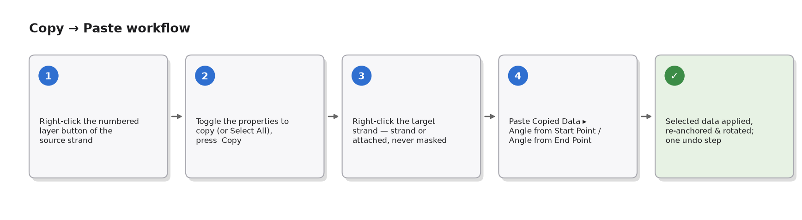
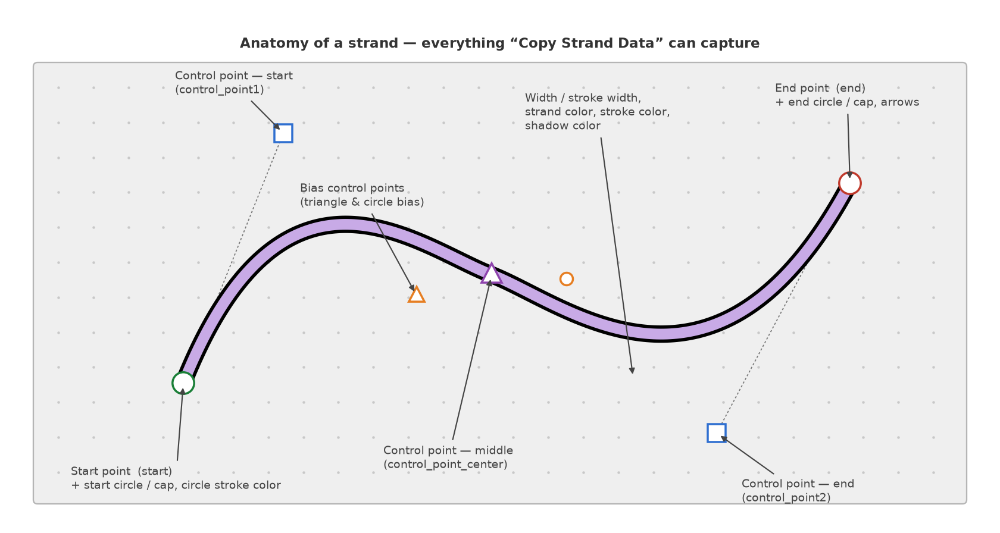
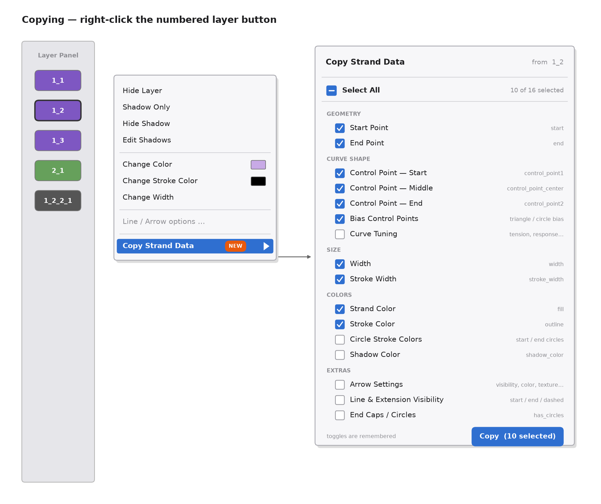
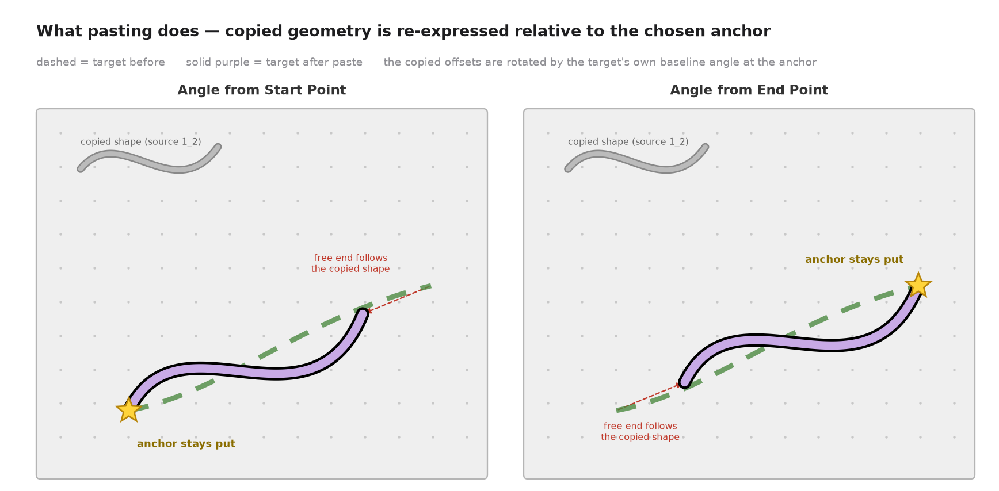

# Copy / Paste Strand Data — Product Concept

> Status: **concept only** — no application code has been changed. This folder contains the
> product spec plus mockup images (generated by the helper scripts in [`tools/`](tools/)).

## Summary

A new **Copy Strand Data** option on the numbered layer button lets the user pick exactly
*which* pieces of a strand to copy — geometry (start/end points, the three control points,
bias control points), sizes (width, stroke width), colors (strand color, stroke color, …)
and extras — via a dropdown panel of toggles with a **Select All** master toggle, in the
same style as the existing Arrow Customization panel.

After copying, right-clicking **another strand** (a regular strand or an attached strand —
never a masked layer) offers **Paste Copied Data** with two placement choices:

- **Angle from Start Point** — the copied geometry is re-anchored at the target's start
  point and rotated to the target's own baseline angle measured from its start.
- **Angle from End Point** — same, but anchored and angle-matched at the target's end point.

Non-geometric properties (colors, widths, arrow settings…) are simply applied as-is.



---

## 1. What can be copied

Every toggle below maps to real strand attributes (`src/strand.py`), and the set
deliberately mirrors what the app already saves to JSON (`serialize_strand`,
`src/save_load_manager.py:109`) and what group duplication already copies in memory
(`GroupPanel.copy_strand_properties`, `src/group_layers.py:3217`).



| Group | Toggle | Strand attributes | Geometric? |
|---|---|---|---|
| **Geometry** | Start Point | `start` | yes |
| | End Point | `end` | yes |
| **Curve shape** | Control Point — Start | `control_point1` | yes |
| | Control Point — Middle | `control_point_center`, `control_point_center_locked`, `triangle_has_moved` | yes |
| | Control Point — End | `control_point2`, `control_point2_shown`, `control_point2_activated` | yes |
| | Bias Control Points | `bias_control.triangle_bias`, `.circle_bias`, `.triangle_position`, `.circle_position` | positions yes, bias values no |
| | Curve Tuning | `curve_response_exponent`, `control_point_base_fraction`, `distance_multiplier`, `endpoint_tension` | no |
| **Size** | Width | `width` | no |
| | Stroke Width | `stroke_width` | no |
| **Colors** | Strand Color (fill) | `color` | no |
| | Stroke Color | `stroke_color` | no |
| | Circle Stroke Colors | `circle_stroke_color`, `start_circle_stroke_color`, `end_circle_stroke_color` | no |
| | Shadow Color | `shadow_color` | no |
| **Extras** | Arrow Settings | `start_arrow_visible`, `end_arrow_visible`, `full_arrow_visible`, `arrow_color`, `arrow_transparency`, `arrow_texture`, `arrow_shaft_style`, `arrow_head_visible`, `arrow_casts_shadow` | no |
| | Line & Extension Visibility | `start_line_visible`, `end_line_visible`, `start_extension_visible`, `end_extension_visible` | no |
| | End Caps / Circles | `has_circles`, `elliptical_end_caps` | no |

The "Geometric?" column matters at paste time: only geometric values go through the
anchor + rotation mapping (section 4); everything else is assigned directly.

Default toggle state on first use: the two endpoint toggles, the three control-point
toggles, bias control points, width, stroke width, strand color and stroke color **on**;
everything else **off**. The last-used state is remembered for the session.

---

## 2. Copying — the layer-number-button dropdown

Right-click the numbered layer button of the source strand. Below the existing entries
(Hide Layer, Shadow Only, …, Change Color, Change Width, arrow options) a new entry
**Copy Strand Data ▸** opens the toggle panel:



Behavior details:

- **Select All** is a tri-state master toggle, exactly like the global-toggle rows already
  used in the Group Shadow editor (`src/group_shadow_editor_dialog.py:283-298`):
  clicking it while mixed selects everything; clicking again clears everything; it shows
  the indeterminate mark while only some toggles are on.
- The panel is embedded in the context menu the same way the existing **Arrow
  Customization** block is (a `QWidgetAction` holding a widget with checkboxes /
  combo boxes, `src/numbered_layer_button.py:617+`), so it inherits the app's menu
  look-and-feel and theming.
- The **Copy (N selected)** button snapshots the selected values into an in-memory
  clipboard and closes the menu. The button is disabled when nothing is selected.
- Copy is offered on **regular strands and attached strands**. For masked layers the
  entry is hidden in v1 (they have no control points and their geometry is derived from
  the two masked layers — see `src/masked_strand.py`).

### Clipboard model

- One application-level clipboard slot (e.g. `canvas.strand_clipboard`), overwritten by
  the next copy. It stores plain data — fresh `QPointF` / `QColor` copies plus floats and
  bools, never live object references (the same rule `copy_strand_properties` follows;
  Qt objects must not be `deepcopy`-ed).
- The snapshot also records the source's `layer_name` (for the "Clipboard: N properties
  from 1_2" hint) and the source's start→end baseline angles needed for pasting.
- Because it is a snapshot, deleting or editing the source strand afterwards does not
  affect what will be pasted. The clipboard lives for the session; persisting it into the
  saved project file is a possible follow-up (section 7).

---

## 3. Pasting — right-click on the target strand

With something in the clipboard, right-clicking another strand offers
**Paste Copied Data ▸** with the two anchor choices:


- **Eligible targets:** `Strand` and `AttachedStrand`. **`MaskedStrand` never shows the
  entry** (same `isinstance(strand, MaskedStrand)` gate the menu already uses at
  `src/numbered_layer_button.py:217`).
- The entry appears in two places for consistency:
  1. the numbered layer button's context menu (existing menu, new entry), and
  2. a small context menu on the **canvas** when right-clicking directly on a strand
     body. Today the canvas has no strand context menu at all, so this is a new, tiny
     menu containing only the paste entry — hit-testing can reuse the same
     strand-under-cursor logic the selection modes use.
- The entry is disabled/hidden when the clipboard is empty, and on the source strand
  itself it is allowed (pasting onto the source is harmless — it re-applies the data).
- A dimmed line under the entry shows what is in the clipboard
  ("Clipboard: 12 properties from 1_2").

---

## 4. Paste semantics — "angle from start" vs "angle from end"

Style properties (widths, colors, arrows, visibility…) are assigned directly. Geometry is
mapped through the chosen **anchor**:



Definition (rotation + translation, **no scaling** — copied distances are preserved):

```
source frame:  origin  A_s = source.start          (or source.end for "from end")
               angle   θ_s = atan2(other_end − A_s)     # source baseline angle
target frame:  origin  A_t = target.start          (or target.end)
               angle   θ_t = atan2(other_end − A_t)     # target baseline angle
Δθ = θ_t − θ_s

pasted(P) = A_t + R(Δθ) · (P − A_s)      for every copied geometric point P
```

`R(Δθ)` is the 2-D rotation matrix; the angle math is the same
`math.degrees(math.atan2(dy, dx))` used by `AngleAdjustMode.calculate_angle`
(`src/angle_adjust_mode.py:632-635`), and the point rotation is the same operation as
`rotate_point_around_pivot` (`src/angle_adjust_mode.py:402`).

Consequences the user should expect:

- The **anchor point stays put** (star in the mockup). The strand's other end moves to
  wherever the copied shape puts it — if the source was longer, the target becomes longer.
- The copied curve keeps its shape but is rotated so it "flows" along the target's own
  direction at the anchor.
- Pasting with **Angle from End Point** mirrors the flow: offsets are measured from the
  source's end and re-applied from the target's end.

### Interaction between toggles at paste time

| Clipboard contents | Effect on target |
|---|---|
| Both endpoints + control points | Full shape replacement, anchored & rotated as above. |
| Control points only (endpoints not copied) | Target keeps both of its endpoints; the copied control-point *offsets* (from the source anchor, rotated by Δθ) are applied, reshaping the curve between the existing endpoints. |
| Endpoints only | Target becomes the copied baseline (anchored/rotated); its control points are re-derived the way the app does for a fresh strand. |
| Bias control points | Bias *values* (`triangle_bias`, `circle_bias`) copy as-is; bias *positions* go through the anchor mapping like any other point. |
| Only non-geometric toggles | Anchor choice is irrelevant; both menu items apply the same result (menu may collapse to a single "Paste Copied Data" action in that case). |

### Attached-strand targets

An `AttachedStrand`'s start is glued to its parent (it stores `angle` + `length` and
recomputes `end` from them, `src/attached_strand.py:34-35, 310-313`), so:

- The **Start Point toggle is ignored** for attached targets — the start cannot leave the
  parent. "Angle from Start Point" therefore behaves most naturally for them.
- After pasting, the attached strand's `angle` / `length` are recomputed from the new
  geometry (`atan2`, as in `src/attached_strand.py:328-330`) so later parent moves keep
  working correctly.
- Strands attached **to the target** stay attached: after the paste the usual
  attachment/knot update path runs so children follow the moved end, exactly as they do
  after an angle-adjust rotation (`rotate_attached_strand`, `src/angle_adjust_mode.py:494`).

### Undo / redo

One paste = **one undo step** (a single state snapshot through the existing
undo/redo manager), regardless of how many properties were applied. Copying is not an
undoable action (it changes no document state).

---

## 5. Edge cases & rules

- **Masked layers** (`MaskedStrand`): no copy entry, no paste entry (v1). Their geometry
  is derived from the two strands they mask and they have no control points.
- **Hidden / locked layers**: copying from a hidden strand is allowed (data is data);
  pasting onto a locked layer is blocked with the usual locked-layer feedback.
- **Empty clipboard**: paste entries are hidden (or shown disabled with a hint).
- **Degenerate baseline**: if a strand's start and end coincide, its baseline angle is
  undefined — fall back to Δθ = 0 (translation only) and log it.
- **`control_point2_shown` / `control_point2_activated` / `triangle_has_moved`** travel
  with their owning control-point toggle so the pasted curve renders exactly like the
  source (these flags gate how the app draws/uses the points).
- **Bias positions of `None`** (never dragged): copy the `None`; the app will lay the
  bias controls out on the new curve as it does for a fresh strand.
- **Knot/attachment bookkeeping is never copied**: `layer_name`, `set_number`,
  `attached_strands`, `knot_connections`, `attachment_side`, parent references stay
  untouched — pasting restyles/reshapes the target, it never rewires the diagram
  (the same exclusions `copy_strand_properties` and `serialize_strand` make).

---

## 6. Translations

New strings needed (added to `src/translations.py`, which already has `select_all` /
`deselect_all` entries): "Copy Strand Data", "Paste Copied Data", "Angle from Start
Point", "Angle from End Point", "Select All", the group headers, the toggle labels, and
the clipboard hint. RTL layouts follow the existing menu handling.

---

## 7. Open questions / future ideas (not in v1)

1. **Fit mode**: an optional scaling variant that also scales copied offsets so the free
   end lands exactly on the target's old end (shape adapts to the target's length).
2. **Paste onto multiple selected strands** in one action.
3. **Persist the clipboard** in the project JSON so copy/paste survives restarts.
4. **Named presets**: save a toggle combination ("colors only", "shape only") for reuse.
5. **Copy from masked layers** (styles only — colors/widths — since geometry is derived).

---

## 8. Implementation pointers (for the eventual code change)

| Concern | Existing precedent |
|---|---|
| Menu entry + embedded toggle panel | `NumberedLayerButton.show_context_menu` (`src/numbered_layer_button.py:175`); Arrow Customization `QWidgetAction` panel (`:617+`) with `QComboBox`/`QCheckBox` |
| Masked-layer gating | `isinstance(strand, MaskedStrand)` branch (`src/numbered_layer_button.py:217, 350, 386`) |
| Select-All master toggle | `GroupShadowEditorDialog._toggle_all_*` (`src/group_shadow_editor_dialog.py:283-398`) |
| Property snapshot / apply without `deepcopy` | `GroupPanel.copy_strand_properties` (`src/group_layers.py:3217-3359`) — builds fresh `QPointF`/`QColor` |
| Canonical field list | `serialize_strand` (`src/save_load_manager.py:109-268`) |
| Angle math & point rotation | `AngleAdjustMode.calculate_angle` (`src/angle_adjust_mode.py:632`), `rotate_point_around_pivot` (`:402`), `rotate_attached_strand` (`:494`) |
| Attached-strand angle/length refresh | `src/attached_strand.py:310-313, 328-330` |

---

## Regenerating the mockups

```bash
pip install matplotlib
cd docs/copy_paste_strand_data/tools
python3 generate_mockups.py            # writes ../mockups/*.png
```

`tools/mockup_common.py` holds the shared drawing helpers; `tools/generate_mockups.py`
renders the five images. Both are documentation helpers only and are not imported by the
application.
