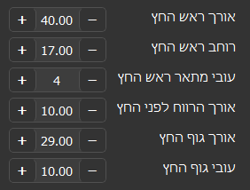
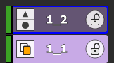
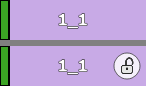
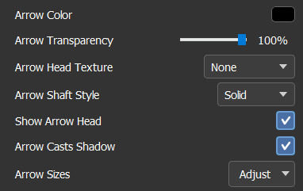
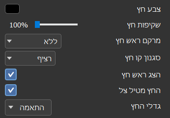

# Hebrew (RTL) Layer-Panel Fixes

Three RTL bugs fixed in `src/numbered_layer_button.py`, verified by
`automation_tests/test_hebrew_rtl_fixes.py`, which launches the real app in
Hebrew, drives it with QTest, asserts the geometry, and writes the proof
PNGs in this folder.

## Fix 1 — Arrow "Adjust" popup: labels on the right

The layer context menu is RTL in Hebrew, which automatically mirrors every
row layout. The arrow-size rows *also* manually reversed their widget order,
so the two flips cancelled out and the Hebrew labels landed on the left.
The rows now use one add order (label, stretch, spin box) and let the RTL
menu do the mirroring.



Test: opens the real context menu popup, pairs each of the 6 labels with its
spin box, and asserts every label center sits to the RIGHT of its spin box.

## Fix 2 — One edge-aligned indicator column (Style B redesign)

The copy badge and the paste anchors were redesigned into one sharp-square
indicator column, 26 px wide (the padlock size), on the trailing side —
right in English, left in Hebrew — always 15 px from the button edge (6 px
clearance from the green strip, kept even without a strip, so neither the
column nor the padlock — inset 6 px on the opposite side — ever touches the
2 px blue/yellow selection borders):

- **Copy badge**: sharp 26 × 26 square with the `copy_badge.png` icon,
  vertically centered.
- **Paste anchors**: one segmented rectangle split by a hairline — ▲ start
  cell on top, ● end cell below (the end side is a circle on canvas, so the
  old ■ became a ●, drawn at exactly the triangle's width). Cell height is
  `min(26, (h − 8) / 2)`, so the stack fits at every button size. Hovering
  tints only the cell under the mouse.

Because everything shares one width and one column, the badge and the stack
are always flush with each other in both directions.



Top button (1_2, hovered paste target): segmented ▲/● stack flush left,
padlock right, name intact. Bottom button (1_1, copy source): copy square
on the same column.

Test: asserts badge and both cells share x == 15 in RTL, the badge is a
26 px square, the cells are equal and stacked ▲-over-●, the cell height
follows the scaling rule, and the stack stays inside the button.

## Fix 3 — Lock mode no longer moves the layer names

Lock mode used to re-center the name between the padlock and the green
strip, which pushed it over the paste chips. The re-centering was removed;
the text keeps the identical centered position in every mode.



Top: normal mode. Bottom: lock mode (padlock appears, text unmoved).

Test: grabs the same button before/after enabling lock mode and asserts the
text region (excluding the strip and padlock spans) is pixel-identical.

## Fix 4 — Arrow-menu dropdowns: Hebrew text flush right

The texture (מרקם ראש חץ) / shaft style (סגנון קו חץ) combos and the Arrow
Sizes "Adjust" button kept LTR text alignment in Hebrew. `style_menu_combobox()`
now sets an explicit layout direction, uses one LTR stylesheet that Qt mirrors
automatically, and (Hebrew only) draws the closed text via a read-only line
edit pinned to the field and aligned to the literal right edge — measured at
10–11 px from the right edge, matching English's 10–11 px from the left.
A click filter keeps "click anywhere opens the list" behavior.




Test: opens the real context menu and asserts each combo's text sits 6–14 px
from its right edge.

## Running the test

```
python automation_tests/test_hebrew_rtl_fixes.py            # headless
python automation_tests/test_hebrew_rtl_fixes.py --visible  # real fonts in PNGs
```

Exit code 0 = all checks passed. The headless run validates all geometry;
the `--visible` run was used for these PNGs because the offscreen platform
does not render text glyphs.
