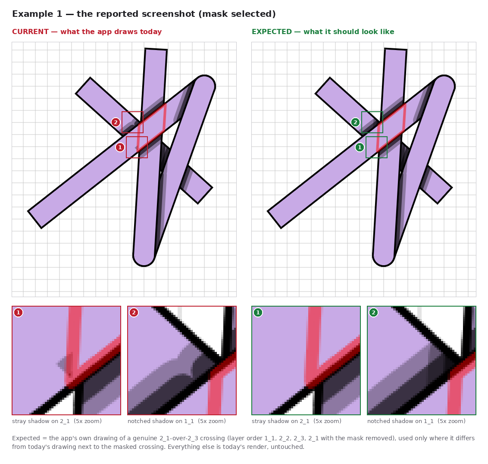
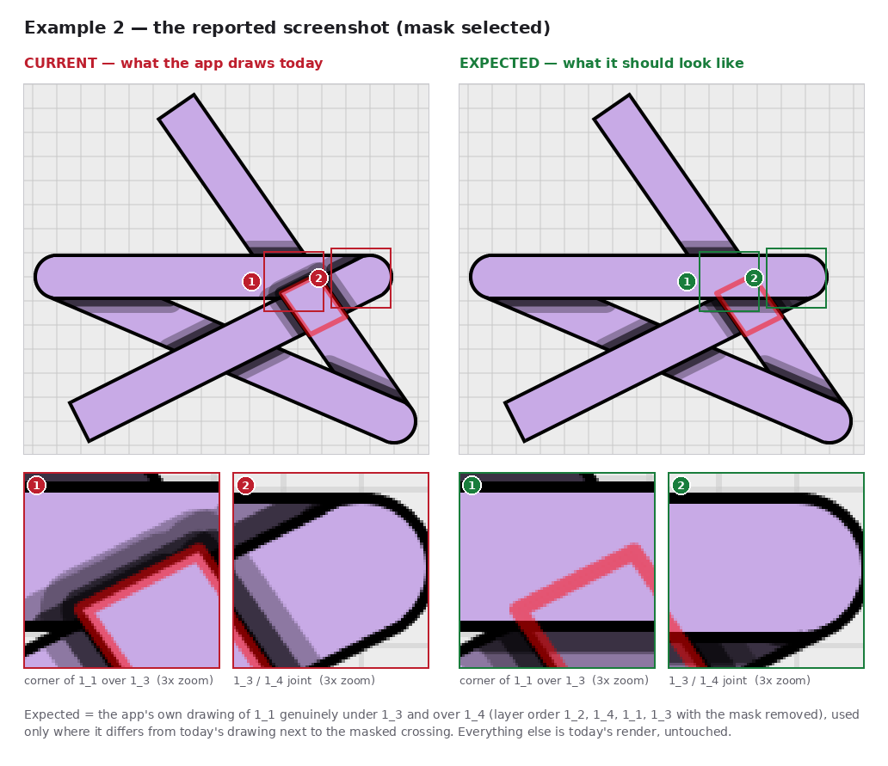

# Mask shadow observations

A catalogue of how shadows look **around masked crossings** today, next to how they should look.
Each example has a scene you can open in the app, the current drawing, the expected drawing, and notes
on what differs and why. These are observations, meant to steer a later fix; no rendering code is changed here.

## What a mask should look like

A mask (`a_b_c_d`) is a local layer swap: at the crossing it covers, strand `a_b` must look **exactly**
as if it were genuinely above `c_d` in the layer order. For shadows that means:

1. **The top strand casts its normal shadow on the bottom strand.** Same soft band on both sides of the
   crossing as any regular crossing.
2. **Nothing from below lands on the top strand.** Near the crossing, neither the bottom strand's own
   shadow nor the blurred edge of shadows it casts on strands further down may darken the top strand.
3. **Other strands are unaffected by the mask.** A third strand passing under the crossing gets the same
   shadows it would get without the mask: straight bands along each strand above it, meeting at clean
   corners, with no notches, bumps, or missing pieces. A third strand that lies *above* the top strand stays
   above it, even where it overlaps the masked crossing: the mask changes one pair of strands, not the
   whole stack.
4. **Nothing depends on the view.** Selection, zoom, and pan don't change the shading.

## How "expected" is made

Expected images are rendered, not painted. The example's scene is drawn a second time with the masked
crossing expressed as a genuine layer order (the mask's first strand moved above its second strand, mask
removed). That is how the app already draws a normal crossing. Pixels that differ from the current
drawing near the masked crossing are transplanted into it. Places the reordering also changes but the
mask does not govern are declared as `keep_zones` (strand pairs) in the example's `example.json` and
stay as the app draws them today.

When the crossings form a loop (a under b, b under c, c under a), no layer order draws the whole scene.
The reference order is then chosen so that it is right everywhere near the mask, and the loop gives way
at a joint that is kept as drawn today (see example 2).

[`automation_tests/capture_mask_shadow_observations.py`](../../automation_tests/capture_mask_shadow_observations.py)
regenerates every image. It drives the real app offscreen, loads `scene.json` through the same history
import as **Load**, and also records which shadow pass paints each visible shadow pixel:

```
QT_QPA_PLATFORM=offscreen python automation_tests/capture_mask_shadow_observations.py
```

## Adding an example

1. Create `example_NN_<short_name>/` with the scene as `scene.json` (a saved history file). Optionally add
   the reported screenshot and its canvas offset.
2. Add `example.json`, copying example 1. The fields that matter:
   - `mask`: the mask layer.
   - `reference_order`: the layer order that makes the crossing genuine.
   - `keep_zones`: strand pairs whose stacking the reorder also flips.
   - `crop` and `insets`: canvas-space boxes for the figures.
   - `blocker_inset` (optional): which inset the blocker experiment zooms into.
   - `window_size`, `canvas_background` (optional): the reporter's window size and canvas colour, when
     they differ from example 1 (the "default" theme paints the canvas `#ECECEC`).
   - `workaround_order` (optional): a layer order, mask included, that gets close to the expected look
     with today's code. The script renders it and reports how far it is from the expected image.
3. Run the script, then write the example's `README.md`: a table of what differs, and why.

## Examples

| # | Scene | Findings |
|---|---|---|
| [1](example_01_mask_2_1_over_2_3/README.md) | Mask `2_1_2_3` (2_1 over 2_3) beside an unrelated strand `1_1` | The mask's own shadow is right. A stray wedge of 2_3's shadow lands on top of 2_1 (it leaks through the blur clip). 1_1's shadow is notched by the mask's shadow blocker, and switching the blocker off exposes a second wedge. |
| [2](example_02_mask_1_1_over_1_4/README.md) | Mask `1_1_1_4` (1_1 over 1_4) right where 1_1 also passes under 1_3 | The mask's shading on 1_4 is right. The mask, sitting at the top of the stack, also paints a corner of 1_1 over 1_3 and casts a shadow onto it. Expected: 1_3 stays on top along its whole band and casts its usual shadow, which also puts 1_3 over 1_4 at their hairpin joint. Moving 1_3 above the mask in the layer panel already gets within 141 px of that. |




