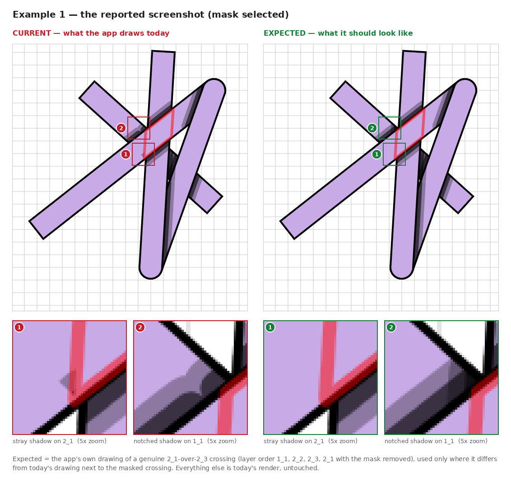
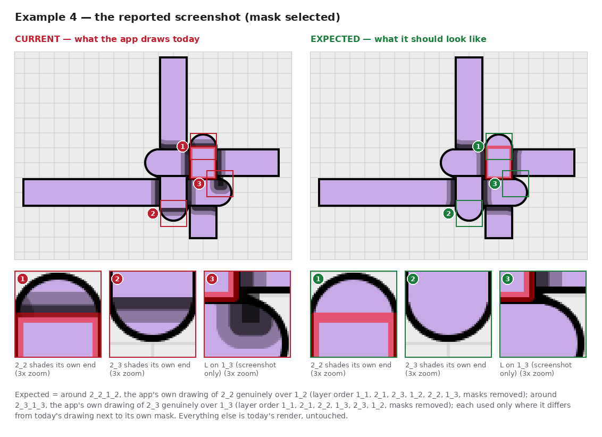
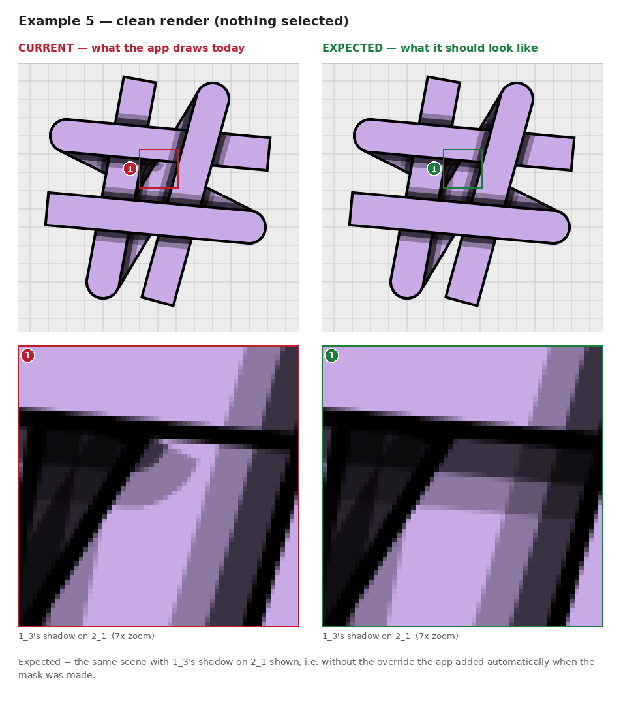

# Mask shadow observations

A catalogue of how shadows looked **around masked crossings**, next to how they should look.
Each example has a scene you can open in the app, the drawing before the fix (`current.png`), the expected
drawing, and notes on what differs and why. The fix is described [below](#the-fix): the app now draws the
expected images, apart from anti-aliasing.

## What a mask should look like

A mask (`a_b_c_d`) is a layer. It draws strand `a_b`'s piece of the crossing with `c_d` at the mask's own
place in the layer order: over every strand below the mask, under every strand above it. Around that piece,
strand `a_b` must look **exactly** as if it were genuinely above `c_d` in the layer order. For shadows that
means:

1. **The top strand casts its normal shadow on the bottom strand.** Same soft band on both sides of the
   crossing as any regular crossing.
2. **Nothing from below lands on the top strand.** Near the crossing, neither the bottom strand's own
   shadow nor the blurred edge of shadows it casts on strands further down may darken the top strand. The
   mask does not shade the top strand either: its continuation just past the crossing (for example its
   rounded end) stays clean.
3. **Other strands are unaffected by the mask.** A third strand passing under the crossing gets the same
   shadows it would get without the mask: straight bands along each strand above it, meeting at clean
   corners, with no notches, bumps, or missing pieces. Outside the piece, every other pair of strands keeps
   the layer order. Where a third strand below the mask crosses the piece, the piece lies over it, like any
   layer above it (example 2), and no strand below the mask shades the piece (example 4).
4. **Nothing depends on the view.** Selection, zoom, and pan don't change the shading.

## How "expected" is made

Expected images are rendered, not painted. The example's scene is drawn a second time with the masked
crossing expressed as a genuine layer order (the mask's first strand moved above its second strand, mask
removed). That is how the app already draws a normal crossing. Pixels that differ from the current
drawing near the masked crossing are transplanted into it. Places the reordering also changes but the
mask does not govern are declared as `keep_zones` (strand pairs) in the example's `example.json` and
stay as the app draws them today.

When the crossings form a loop (a under b, b under c, c under a), no single layer order draws the whole
scene. Each reference is then used only in its own `area` near the mask (example 4: one reference per mask).
The masks' pieces stay as the app draws them (`outside_pieces_px`): a mask is a layer, and its piece was
always drawn at the right place in the stack. Where the piece lies over a third strand, no layer order
draws it at all; example 2 then also uses the app's own drawing with the mask's shadow passes and its
shadow blocker switched off (`reference_skip`, `reference_neutralise_blocker`).

[`automation_tests/capture_mask_shadow_observations.py`](../../automation_tests/capture_mask_shadow_observations.py)
regenerates every image. It drives the real app offscreen, loads `scene.json` through the same history
import as **Load**, and also records which shadow pass paints each visible shadow pixel:

```
QT_QPA_PLATFORM=offscreen python automation_tests/capture_mask_shadow_observations.py
```

It draws with the code in `src/`. The committed images record the app before the fix; to regenerate them,
run the script from a checkout of the commit before the fix (for example `git worktree add`), since today's
code draws `current.png` the way `expected.png` looks.

## The fix

The renderer now shades every masked crossing like the genuine crossing it stands for, with the mask still
drawn as a layer at its own place in the stack
([`src/shader_utils.py`](../../src/shader_utils.py), [`src/masked_strand.py`](../../src/masked_strand.py)):

- **A mask no longer casts shadows of its own.** Everything around the lifted piece is the first strand's
  own shadow, computed in its own pass exactly as for a genuine crossing. The mask re-applies the part that
  falls on the second strand (`draw_mask_lift_shadow`), which is drawn after the first strand's pass.
- **No shadow blocker.** Shadows cast from below a mask are no longer cut by the mask grown by the blur,
  which notched the shadows of strands the mask does not cover (examples 1 and 4).
- **Local restacking.** Near a mask, the first strand and the strands crossing over it (its *upper side*)
  lie above the second strand and the strands it crosses over (its *lower side*), as if the first strand
  had been moved above the second in the layer order. Every shadow near the mask is computed with that
  order: which strands lie between a caster and its receiver, and where the blurred edge may land. When the
  mask covers the whole overlap of its two strands (nothing erased), the first strand lies above the second
  everywhere. A strand above the first strand and below the second that crosses both keeps its place in
  the layer order: the mask swaps its own two strands only (example 2's 1_3 stays under 1_4).
- **The mask stays a layer.** Its piece is drawn at the mask's place in the layer order, as before the fix:
  over every strand below the mask (example 2's corner over 1_3), and no strand it is drawn over shades it
  (example 4).
- **Shadows the piece paints over go back on top.** The piece is filled flat with the first strand's colour
  and reaches 2 px past the second strand's outline (to hide that edge), so it covered the end of every
  soft shadow band already on the first strand there, which then ended in a sharp cut. Those shadows come
  from strands above the first strand that do not pass under the piece, and from strands that masks earlier
  in the order lift over the first strand (in a triaxial weave, both at every junction).
  `draw_mask_restored_shadows` paints them again over the piece, right after it is filled. A strand's shadow on
  the second strand is cut by the piece first, as the first strand would cut it at a genuine crossing.
- **Pan and zoom draw the same** as the default view: both mask drawing paths share the same code.
- **Closed shadow outlines.** A shadow's soft edge is stroked along the outline of the area it falls on.
  Qt's `intersected()` with an axis-aligned rectangle returns that outline open, and the stroke then misses
  its last side. Before the fix the blocker's extra path operations happened to close it near masks; without
  them a woven star lost the soft edge below a horizontal strand next to a mask. Outlines are now closed
  before they are stroked (`_closed_outline`), which also restores that edge where no mask is involved (a
  horizontal strand over one drawn from the bottom right up to the top left lost it before the fix too).
- **The same drawing every time.** Near masks the strands are restacked in layer order; before, the order came
  from Python sets, which changes between runs, and a crowded scene could come out slightly different
  (by at most 1/255 here) each time it was opened.
- **The Shadow Editor's preview shows what is drawn.** It is computed by the same per-pair code as the canvas
  (`_pair_shadow`; for a mask's row, the shadow the mask paints on its second strand), and filled with the
  painter clipped to where the shadow shows (`shadow_preview`): the receiver's clip, minus the pieces of masks
  drawn over the shadow later. The painter does that clipping, not Qt's path operations, which can return an
  empty path when a piece is subtracted from a strand with an end circle. Before, the preview had its own copy
  of the old computation: blockers included, the caster grown by twice the soft edge's reach, and a mask's row
  showing the mask's old shadow of its own, cut away by the mask's own blocker. `auto_shadow.py` keeps that
  old measure (`_surviving_shadow`), which its threshold was tuned on.
- **Overlapping receivers keep their shadow.** A strand's shadow is clipped to the strands it falls on, joined
  into one clip. The pass added each strand's outline to that clip, but once the clip is the result of a
  boolean operation (a "subtracted layers" setting on one of the strand's shadows, or a receiver trimmed near
  a mask) adding cancels wherever the outlines overlap. In a box stitch, 2_3's shadow on 1_3 lost its band on
  one side of 2_3 that way, before the fix too. The clip is now united after its first boolean operation.
- **Hidden shadows stay hidden.** A shadow hidden in the Shadow Editor, or by `auto_shadow.py`, was only partly
  hidden: the faded edge of the caster's shadow on a strand below the hidden one is clipped to that strand's
  whole outline, and landed on the hidden one where it lies over it (example 5's half-disc). In example 5's
  scene, hiding any one of 7 of its 15 shadows left 124–262 px of it behind, masks or not. A receiver's clip
  now leaves out the strands between it and the caster whose own shadow from the caster is hidden
  (`_clip_off_hidden_rows`). Where Qt's path subtraction goes wrong, which the result is checked for
  (`_subtracted_checked`), the clip stays as it was: shadow is never lost that way, but in one row of a
  crowded tangle whose masks form a loop the leak remains.
- **The automatic hiding keeps real shadows.** `auto_shadow.py` hides a mask's second strand's shadows on its
  fabric when most of their landing area is covered, as residue. That measure hid a genuine crossing in
  example 5: 1_3 over 2_1, whose landing area is mostly covered by 2_2 but which still shows a full band. It
  now also requires that the canvas would show next to nothing of the shadow (`_visible_shadow_px`: less than
  a quarter of one crossing's band, measured by filling the Shadow Editor's preview of it clipped as the
  canvas draws it). Example 5's shows 771 px and stays; example 4's automatically hidden shadows show 26–52 px
  and the plait's 0 px, and stay hidden.

[`automation_tests/check_shadow_preview.py`](../../automation_tests/check_shadow_preview.py) compares the
Shadow Editor's preview of every row with what the canvas draws for it. It measures a shadow pass, and where
each strand shows, with every other shadow pass switched off: where shadows stack up, the canvas is nearly
black, and the faint end of a soft edge changes it by less than the check counts. The preview matches on every
row of the examples. In a tangle of sticks whose masks form a loop (3_1 over 8_1 over 5_1 over 1_1 over 3_1),
part of 1_1's shadow on 3_1 also lands on 5_1: the preview shows it on the row 1_1 → 3_1, where the canvas
works it out, and the check counts it against the row 1_1 → 5_1.

[`automation_tests/check_hidden_shadow_rows.py`](../../automation_tests/check_hidden_shadow_rows.py) hides
every shadow of every strand in turn, as unticking it in the Shadow Editor does, and checks that the caster
then paints nothing where the receiver shows. Every row of the examples passes; before the fix, 8 of their 42
rows failed: 7 of example 5's and 1 of example 1's.

[`automation_tests/check_mask_shadow_fix.py`](../../automation_tests/check_mask_shadow_fix.py) renders
every example with the code in `src/` and compares it with `expected.png`. It also checks that the
mask-free references are still drawn pixel for pixel as before:

```
QT_QPA_PLATFORM=offscreen python automation_tests/check_mask_shadow_fix.py [out_dir]
```

| Example | Pixels that differ from `expected.png` | What they are |
|---|---|---|
| 1 | 9 | Anti-aliasing (at most 27/255) at the corners of the lifted piece; 8 of them are drawn exactly as before the fix |
| 2 | 48 | Specks along 1_1's edges where the two renders `expected.png` is stitched from meet; the render equals one of them at every one of these pixels |
| 4 | 0 | |
| 5 | 0 | Drawn after the automatic shadow overrides are refreshed, as on the app's next edit of the weave |

## Adding an example

1. Create `example_NN_<short_name>/` with the scene as `scene.json` (a saved history file). Optionally add
   the reported screenshot and its canvas offset.
2. Add `example.json`, copying example 1. The fields that matter:
   - `mask`: the mask layer.
   - `reference_order`: the layer order that makes the crossing genuine.
   - `keep_zones`: strand pairs whose stacking the reorder also flips.
   - `crop` and `insets`: canvas-space boxes for the figures.
   - `blocker_inset` (optional): which inset the blocker experiment zooms into.
   - `window_size`, `canvas_background` (optional): the reporter's window size and canvas colour, when
     they differ from example 1 (the "default" theme paints the canvas `#ECECEC`).
   - `workaround_order` (optional): a layer order, mask included, that gets close to the expected look
     with today's code. The script renders it and reports how far it is from the expected image.
   - `masks` (optional): for scenes no single layer order draws, a list of references, each
     `{mask, reference_order, reference_note, near_mask_px, keep_zones}` plus optional fields:
     - `reference_name`: the reference's file name (default `reference_<mask>.png`);
     - `area`: where the reference applies: `inside` / `outside` (lists of strands), `outside_pieces_px`
       (clear of every mask's piece grown by that many pixels, so the pieces stay as the app draws them)
       and `exclusive` (later references do not take pixels in this area); `area_note` names it in the
       figure;
     - `reference_skip` / `reference_neutralise_blocker`: render the scene as it is (mask included) with
       those shadow passes, or the mask shadow blocker, switched off; only the code before the fix draws
       these, so `check_mask_shadow_fix.py` does not re-render them;
     - `own_piece_px`: take every changed pixel on the mask's own piece (grown by that many pixels) from
       this reference, even inside a keep zone.
   - `screenshot_select` (optional): which layer was selected in the screenshot, if not the mask.
   - `screenshot_unreproduced` (optional): canvas boxes where the screenshot shows something the rebuilt
     scene does not draw; the expected screenshot takes the expected render there.

   An example where the app hides a shadow row by itself (example 5) sets `"kind": "shadow_row"` instead of the
   mask fields: `current.png` is the scene as saved, and `expected.png` the same scene drawn with
   `expected_overrides` as its shadow overrides. `check_mask_shadow_fix.py` draws it as the app does after the
   next edit, which refreshes the automatic overrides.
3. Run the script, then write the example's `README.md`: a table of what differs, and why.

## Examples

| # | Scene | Findings |
|---|---|---|
| [1](example_01_mask_2_1_over_2_3/README.md) | Mask `2_1_2_3` (2_1 over 2_3) beside an unrelated strand `1_1` | The mask's own shadow is right. A stray wedge of 2_3's shadow lands on top of 2_1 (it leaks through the blur clip). 1_1's shadow is notched by the mask's shadow blocker, and switching the blocker off exposes a second wedge. |
| [2](example_02_mask_1_1_over_1_4/README.md) | Mask `1_1_1_4` (1_1 over 1_4) right where 1_1 also passes under 1_3 | The mask is the top layer, so its piece of 1_1 rightly lies over 1_3 in the corner, and 1_4 stays over 1_3 at their hairpin joint. The mask's shading on 1_4 is right. The mask also casts a shadow of its own onto 1_3 around the corner (a thick band with a rounded bump over 1_4's band), and its shadow blocker notches 1_4's shadow there. |
| [4](example_04_two_masks_weave/README.md) | Two masks weaving `2_2` and `2_3` through `1_2` and `1_3` (a 2×2 checkerboard) | Each mask's shading is right. Each mask also shades its own strand's rounded end just past the crossing, and dents the shadows at its corners. The reported screenshot also shows an L-shaped shadow on 1_3 that a fresh load of the layer state does not draw. |
| [5](example_05_mask_2_2_over_1_3/README.md) | Mask `2_2_1_3` (2_2 over 1_3) next to where 1_3 crosses over `2_1` | The app hid 1_3's shadow on 2_1 by itself (`auto_shadow.py`), and a grey half-disc of 1_3's shadow on 1_1 was left on 2_1 where the band should be. |







