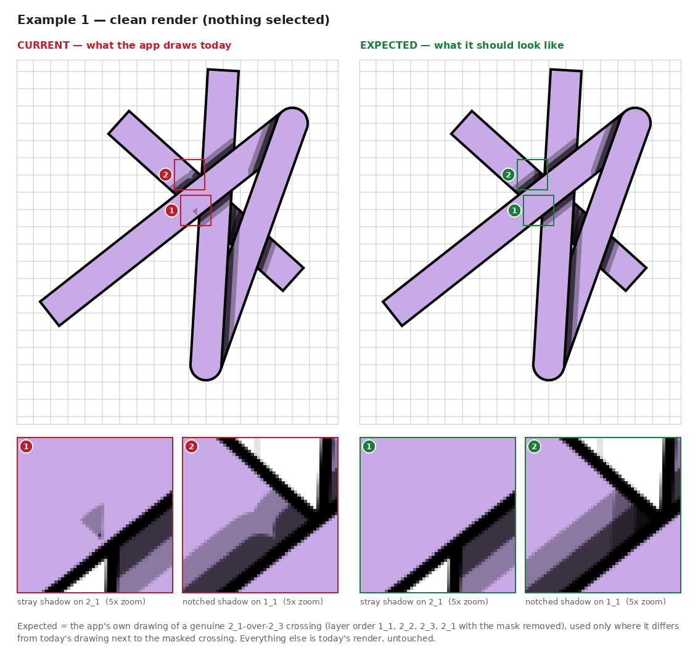
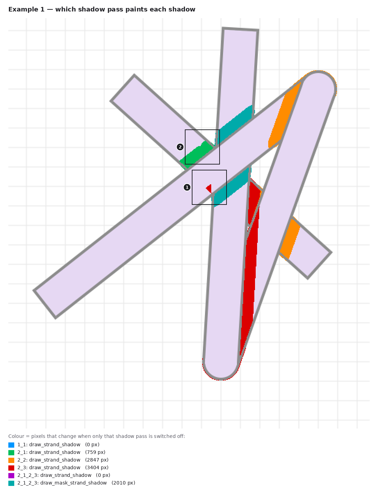
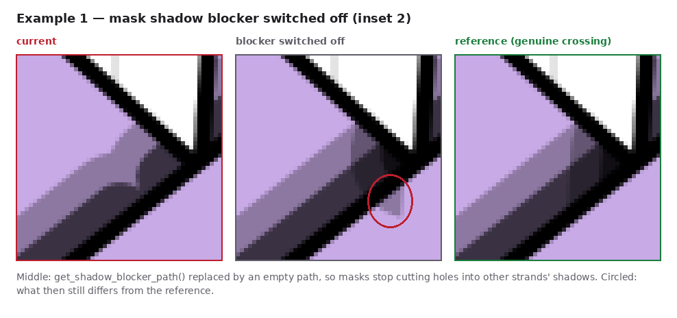

# Example 1: mask `2_1_2_3` (2_1 over 2_3) beside strand `1_1`

The mask flips one crossing so that **2_1 goes over 2_3**, while the layer order still has 2_3 above 2_1.
Strand 1_1 is at the bottom and runs under both strands right next to the mask.

Reported layer state:

| | |
|---|---|
| Order | `1_1, 2_1, 2_2, 2_3, 2_1_2_3` |
| Connections | 2_1 end ↔ 2_2 start, 2_2 end ↔ 2_3 start; 1_1 free |
| Masked layers | `2_1_2_3` (first strand 2_1 on top, second strand 2_3 below) |
| Positions | 1_1 (336,252)→(616,504) · 2_1 (224,560)→(616,252) · 2_2 (616,252)→(476,644) · 2_3 (476,644)→(504,168) |
| Shadow settings | Shadow on, NumSteps 2, MaxBlurRadius 30, color 0,0,0,150; width 46, stroke 4 |

[`scene.json`](scene.json) rebuilds this exact state (open it with **Load**). Rendered headless in the real app,
it matches the reported screenshot pixel for pixel apart from anti-aliasing on outlines
(1,572 of 306,800 pixels differ by more than 8/255, all on stroke edges).

## Screenshot vs expected


Full window: [`user_screenshot.png`](user_screenshot.png) (as reported) and
[`user_screenshot_expected.png`](user_screenshot_expected.png) (the same screenshot with only the two
defects below corrected, 348 pixels in total).

The same comparison without the selection outline, so nothing hides the shadows:



## Observations

| # | Where | Current | Expected (user experience) |
|---|---|---|---|
| ✓ | On 2_3, above and below the masked crossing | A soft band of 2_1's shadow on 2_3, on both sides of 2_1 | Correct as is. These bands are **pixel-identical** to the app's drawing of a genuine 2_1-over-2_3 crossing. |
| 1 | On **2_1**, just left of 2_3's edge, below the crossing | A small dark wedge painted **on top of 2_1**, the strand the mask puts on top | Clean 2_1 fill. Nothing under 2_1 at this crossing may darken it. |
| 2 | On **1_1**, at the mask's upper-left corner | 2_1's shadow band on 1_1 has a rounded notch/bump bitten out of it, and 2_3's shadow along its left edge is missing there | 2_1's straight shadow band meets 2_3's vertical shadow band at a clean corner, as it does without the mask |

Put simply: the mask itself is shaded right, but the shadows *around* it are not. A strand the mask puts
on top still gets dirt from below (1). A third strand that has nothing to do with the mask gets its shadow
cut up near the mask (2).

## Why (observations only; no code is changed by this PR)

Each visible shadow pixel was attributed to the pass that draws it by switching the passes off one at a
time ([`attribution.png`](attribution.png)):



1. **The wedge comes from 2_3's ordinary `draw_strand_shadow` pass, not from the mask.** 2_3 casts onto 1_1.
   The shadow *region* is correctly trimmed by the strands between them (2_1, 2_2;
   `src/shader_utils.py:952`). But the soft edge is drawn by stroking that region with pens up to
   `max_blur_radius` wide, and it is clipped only to 1_1's outline (`clip_path`,
   `src/shader_utils.py:987`/`1398`). So the blur spills up to 15 px onto 2_1 wherever 2_1 covers 1_1.
   Without a mask, 2_3's own shadow on 2_1 would cover that spill. The mask (rightly) removes all 2_3→2_1
   shadows (`part_of_same_visible_mask`, `src/shader_utils.py:663`), which leaves the spill exposed.
   A one-off check rebuilt that region with `shader_utils`' own helpers and predicted the spill; it
   matches the wedge at IoU 0.95 (54 of 57 pixels).
2. **The notch comes from the mask's shadow blocker.** `draw_strand_shadow` subtracts
   `get_shadow_blocker_path(mask)` (the mask outline grown by half the blur) from *every* shadow cast by a
   strand below the mask (`src/shader_utils.py:815`–`823`). That includes shadows onto 1_1, which the mask
   does not cover. This cuts a notch into 2_1's shadow on 1_1, whose blurred edge then draws the rounded
   bump, and it erases 2_3's shadow on 1_1 near the corner.
3. **The two interact.** With the blocker switched off, the notch disappears, but a second wedge (the same
   leak as #1) shows up on 2_1 at this corner. Today the blocker is what hides it. Fixing #2 alone would
   swap one artifact for another; the blur clip from #1 has to be fixed with it.



## Checked and fine

- **The mask's own intersection shadow** (`draw_mask_strand_shadow`) matches the genuine crossing exactly.
- **Selection** changes nothing but the red outline.
- **Zoom / pan**: when zoomed or panned the mask draws through `MaskedStrand._draw_direct`, which passes a
  zero-width stroke outline as the casting path (`src/masked_strand.py:743`). In a one-off check, the bands'
  gradient steps moved by about 1 px (pan (40, −30): 279 pixels differ, by at most 45/255). This is not
  visible at normal size.

## How "expected" was made

Not hand-painted. The same scene is rendered with 2_1 genuinely above 2_3 (layer order
`1_1, 2_2, 2_3, 2_1`, mask removed, [`reference.png`](reference.png)). That is how the app already draws a
real 2_1-over-2_3 crossing. Only the pixels that differ from today's render next to the masked crossing
are taken from it ([`expected.png`](expected.png) vs [`current.png`](current.png)).

The reordering also flips the 2_1/2_2 junction, which the mask does not govern. So everything within 20 px
of both 2_1 and 2_2 is kept exactly as drawn today (`keep_zones` in [`example.json`](example.json)).
[`capture_report.json`](capture_report.json) lists every transplanted piece: 242 pixels in the two spots,
plus two 2-pixel anti-aliasing specks on the mask's corners (246 in all).

Regenerate everything in this folder:

```
QT_QPA_PLATFORM=offscreen python automation_tests/capture_mask_shadow_observations.py docs/mask_shadow_observations/example_01_mask_2_1_over_2_3
```
