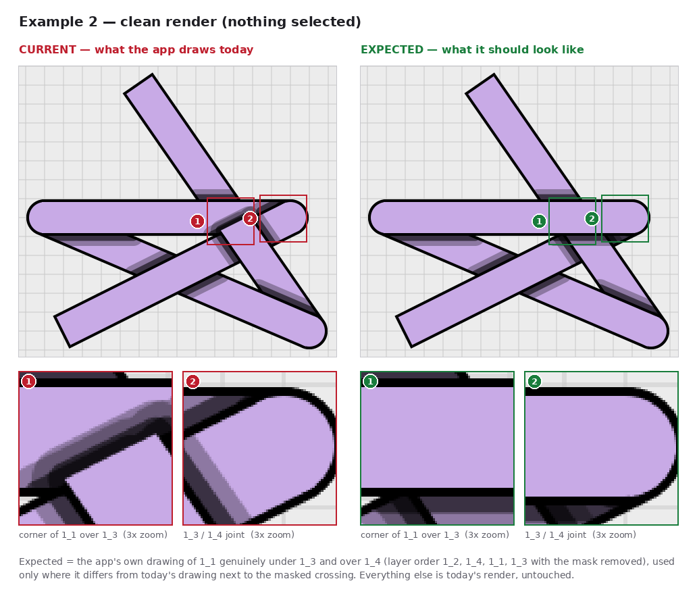
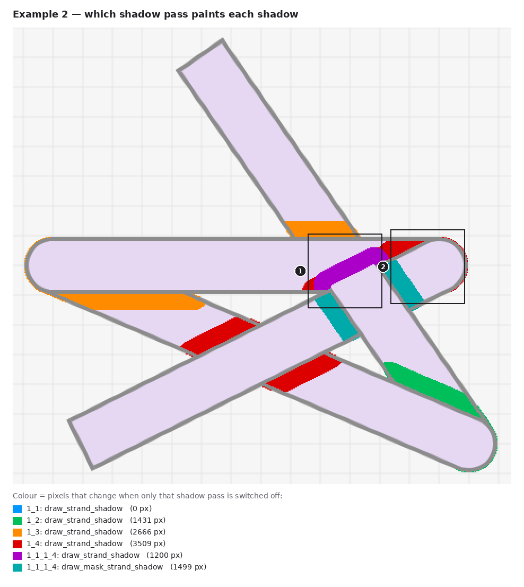

# Example 2: mask `1_1_1_4` (1_1 over 1_4) where 1_1 also passes under 1_3

**Status: fixed.** The app now draws [`expected.png`](expected.png) apart from anti-aliasing (see
[the fix](../README.md#the-fix)): 33 pixels where `expected.png` has a seam on the 1_3/1_4 joint ring and the render
equals the genuine reference, and 9 pixels at the corners of the lifted piece and on the joint ring. The images
below show the app before the fix.

One strand set bent into a star: 1_1 → 1_2 → 1_3 → 1_4, each attached to the end of the one before. The mask
lifts 1_1 over 1_4. Just above that crossing, 1_1 also passes **under** 1_3, and the two crossings overlap.
1_3 and 1_4 meet in a sharp hairpin at (1512, 504), so they overlap in a long wedge, and 1_1 runs straight
through that wedge.

Reported layer state:

| | |
|---|---|
| Order | `1_1, 1_2, 1_3, 1_4, 1_1_1_4` |
| Connections | 1_1 end ↔ 1_2 start, 1_2 end ↔ 1_3 start, 1_3 end ↔ 1_4 start |
| Masked layers | `1_1_1_4` (first strand 1_1 on top, second strand 1_4 below) |
| Positions | 1_1 (1288,308)→(1540,672) · 1_2 (1540,672)→(1148,504) · 1_3 (1148,504)→(1512,504) · 1_4 (1512,504)→(1176,672) |
| Shadow settings | Shadow on, NumSteps 2, MaxBlurRadius 30, color 0,0,0,150; width 46, stroke 4; "default" theme (canvas #ECECEC) |

[`scene.json`](scene.json) rebuilds this state (open it with **Load**). Rendered headless with the mask
selected, it matches the reported screenshot in all but 6 of 202,100 compared pixels. The red outline in the
screenshot is the mask's selection highlight.

## Screenshot vs expected


Full canvas crop: [`user_screenshot.png`](user_screenshot.png) (as reported) and
[`user_screenshot_expected.png`](user_screenshot_expected.png). In the expected screenshot the selection
highlight still outlines the whole mask shape; the outline is not a shadow and is left as the app draws it.

The same comparison without the selection outline:



## Observations

| # | Where | Current | Expected (user experience) |
|---|---|---|---|
| ✓ | On 1_4, below 1_3's band | 1_1's soft shadow bands on 1_4 on both sides of 1_1 | Correct as is. More than 15 px from 1_3 they are pixel-identical to the app's drawing of a genuine 1_1-over-1_4 crossing; closer in, 1_3's new shadow overlaps them. |
| 1 | Inside **1_3's** band, where 1_1 crosses both 1_3 and 1_4 | A corner of the mask is painted **on top of 1_3**: 1_3's lower edge is cut, 1_1's outline shows inside 1_3, and the mask casts a shadow band onto 1_3 | 1_3 stays on top of 1_1 along its whole band, as it does a few pixels further up. Its lower edge runs straight across 1_1, and 1_3 casts the same shadow band below its lower edge (onto 1_1 and 1_4) that it already casts above its upper edge. |
| 2 | 1_3 / 1_4 hairpin at (1512, 504) | 1_4 lies over 1_3: its edge and a shadow band run across 1_3's rounded end | 1_3's rounded end lies over 1_4, with 1_3's shadow on 1_4 |

Put simply: the user asked for 1_1 over 1_4, and 1_3 was already over 1_1. The mask should change only the first
of those. Today it changes both in the corner where the three strands overlap.

## Why the joint has to change too (2)

The three crossings form a loop: 1_1 under 1_3, 1_3 under 1_4 (the order at their joint), 1_4 under 1_1 (the
mask). No layer order can draw a loop, which is why the mask is needed at all. Where the loop gives way is
normally invisible, but here all three strands overlap in one spot. 1_1 passes *between* the two arms of
the 1_3/1_4 hairpin, under 1_3 and over 1_4, so in that spot 1_3 has to be above 1_4.

If the joint kept 1_4 on top, 1_4 would have to switch from above 1_3 to below it somewhere inside 1_3's band.
That leaves 1_3's lower edge and 1_4's upper edge stopping dead at the same point, which looks broken. (We
tried it: keeping the joint as today and taking only the corner from the reference produces exactly that.)
Putting 1_3 on top of 1_4 along the whole hairpin, joint included, is the only way to draw it without a seam.

The 1_1/1_2 joint at the bottom (1540, 672) is part of a second loop (1_1 under 1_2, 1_2 under 1_4, 1_4 under 1_1).
That one never overlaps the mask, so it gives way unseen and stays exactly as drawn today.

## Which pass paints what



Inside the area that changes (5,280 pixels, anti-aliasing included):

- **Purple, `1_1_1_4: draw_strand_shadow` (1,200 px): all of it goes.** It is the mask casting a shadow onto 1_3,
  and it only makes sense if the mask is above 1_3. (In example 1 this pass paints nothing.)
- **Red, `1_4: draw_strand_shadow` onto 1_3 (1,486 of 3,509 px): goes.** These are the shadows along 1_4's edge
  across the hairpin, now under 1_3.
- **Cyan, `1_1_1_4: draw_mask_strand_shadow`: 979 of 1,499 px change, all within 15 px of 1_3.** 583 of them ran
  up into the corner and are now covered by 1_3; the rest are where 1_3's new shadow overlaps the bands.
- **`1_3: draw_strand_shadow` gains 1,430 px:** the band below 1_3's lower edge.
- 852 of the changed pixels differ even with every shadow switched off. That is the stacking itself: the mask's
  corner and 1_4's end over 1_3.

The mask's shadow blocker matters little here (switching it off changes 91 pixels of 1_4's
shadow on 1_3 inside the corner), so this example has no blocker experiment.

## Getting this look today

Move 1_3 above the mask in the layer panel (order `1_1, 1_2, 1_4, 1_1_1_4, 1_3`). The app then draws
[`workaround.png`](workaround.png), which differs from the expected image in 141 pixels: anti-aliasing on 1_3's
rounded end, plus a sliver of about 20 px where 1_3's shadow meets 1_1's right edge. So today's code can already
draw the expected picture. The problem is where the mask sits in the stack. A new mask goes to the top of the
layer list, and there it also covers every strand in between, here 1_3.

## How "expected" was made

The same scene is rendered with layer order `1_2, 1_4, 1_1, 1_3` and the mask removed
([`reference.png`](reference.png)): 1_1 genuinely under 1_3 and over 1_4. Pixels that differ from today's render
next to the masked crossing are taken from it ([`expected.png`](expected.png) vs [`current.png`](current.png)).
That order also puts 1_1 over 1_2 at their joint, which the mask does not govern, so everything within 20 px of
both 1_1 and 1_2 is kept as drawn today (`keep_zones` in [`example.json`](example.json)).
[`capture_report.json`](capture_report.json) lists the transplanted pieces (4,268 pixels before the 1-pixel
anti-aliasing margin).

Regenerate everything in this folder:

```
QT_QPA_PLATFORM=offscreen python automation_tests/capture_mask_shadow_observations.py docs/mask_shadow_observations/example_02_mask_1_1_over_1_4
```
