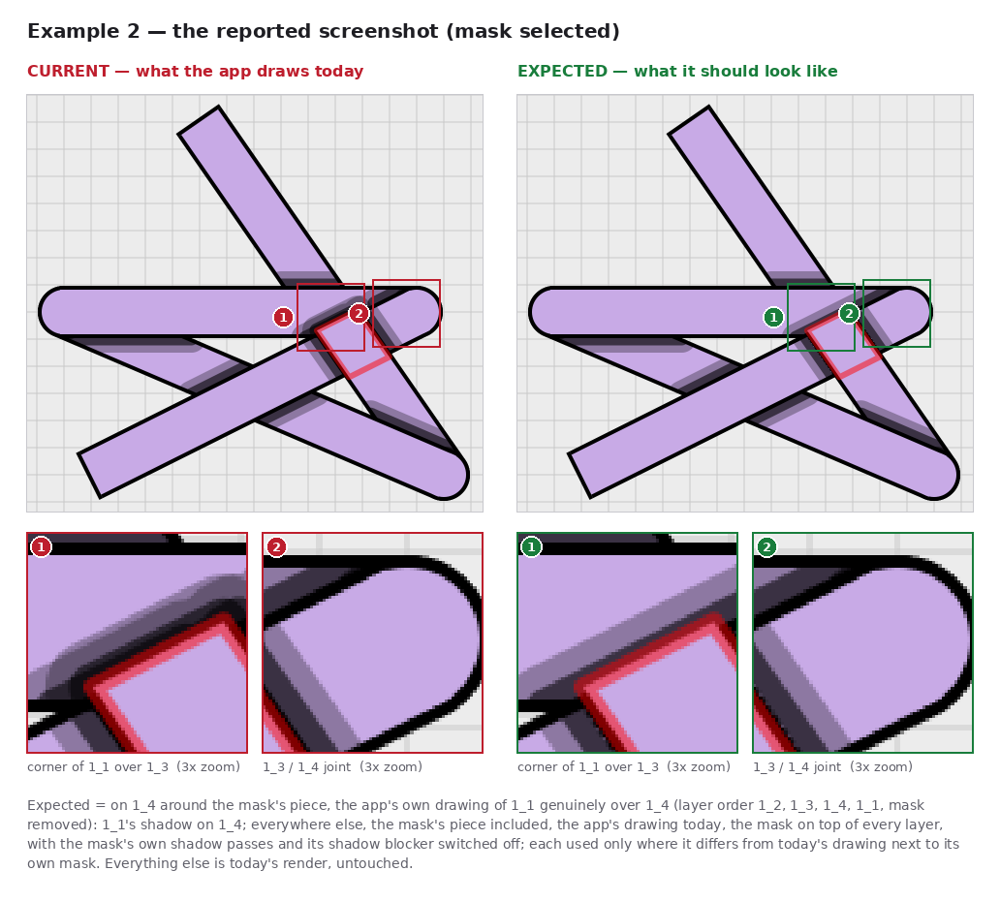
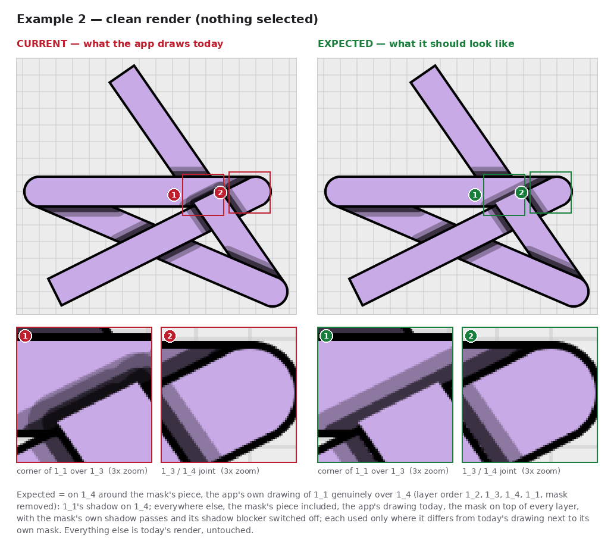
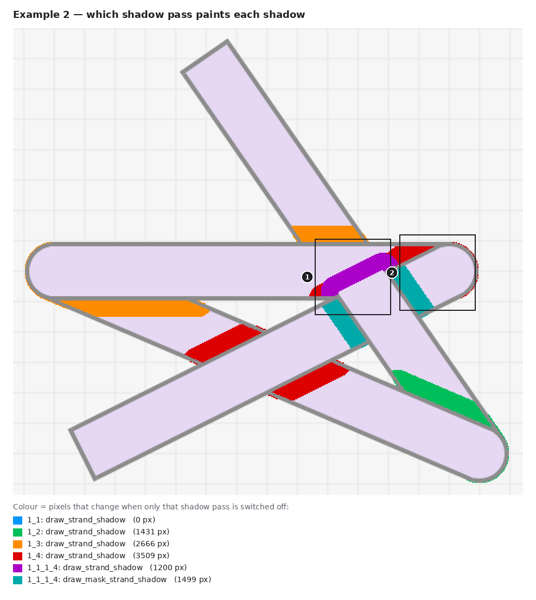

# Example 2: mask `1_1_1_4` (1_1 over 1_4) where 1_1 also passes under 1_3

**Status: fixed.** The app now draws [`expected.png`](expected.png) apart from 48 pixels along 1_1's edges,
where the two renders `expected.png` is stitched from meet; at each of them the render equals one of the two (see
[the fix](../README.md#the-fix)). The images below show the app before the fix.

**Corrected on review:** an earlier version of `expected.png` redrew 1_3 on top of the lifted piece and put 1_3
over 1_4 at their hairpin joint. Both were wrong. A mask is a layer: `1_1_1_4` is the fifth and top layer, so its
piece of 1_1 (where 1_1 and 1_4 cross) lies on top of every strand, 1_3 included. Everything else keeps the layer
order, so 1_4 stays over 1_3 at the joint. The drawing before the fix already had all of that right; only its
shadows around the piece needed fixing.

One strand set bent into a star: 1_1 → 1_2 → 1_3 → 1_4, each attached to the end of the one before. The mask
lifts 1_1 over 1_4. Just above that crossing, 1_1 also passes **under** 1_3, and the two crossings overlap.
1_3 and 1_4 meet in a sharp hairpin at (1512, 504), so they overlap in a long wedge, and 1_1 runs straight
through that wedge.

Reported layer state:

| | |
|---|---|
| Order | `1_1, 1_2, 1_3, 1_4, 1_1_1_4` |
| Connections | 1_1 end ↔ 1_2 start, 1_2 end ↔ 1_3 start, 1_3 end ↔ 1_4 start |
| Masked layers | `1_1_1_4` (first strand 1_1 on top, second strand 1_4 below) |
| Positions | 1_1 (1288,308)→(1540,672) · 1_2 (1540,672)→(1148,504) · 1_3 (1148,504)→(1512,504) · 1_4 (1512,504)→(1176,672) |
| Shadow settings | Shadow on, NumSteps 2, MaxBlurRadius 30, color 0,0,0,150; width 46, stroke 4; "default" theme (canvas #ECECEC) |

[`scene.json`](scene.json) rebuilds this state (open it with **Load**). Rendered headless with the mask
selected, it matches the reported screenshot in all but 6 of 202,100 compared pixels. The red outline in the
screenshot is the mask's selection highlight.

## Screenshot vs expected



Full canvas crop: [`user_screenshot.png`](user_screenshot.png) (as reported) and
[`user_screenshot_expected.png`](user_screenshot_expected.png). In the expected screenshot the selection
highlight still outlines the whole mask shape; the outline is not a shadow and is left as the app draws it.

The same comparison without the selection outline:



## Observations

| # | Where | Current | Expected (user experience) |
|---|---|---|---|
| ✓ | The lifted piece, where 1_1 crosses 1_4 | 1_1 lies on top of every strand, 1_3 included (a corner of 1_1 over 1_3's band) | Correct as is: the mask is the top layer |
| ✓ | 1_3 / 1_4 hairpin at (1512, 504) | 1_4 over 1_3, with 1_4's shadow on 1_3 | Correct as is: the layer order puts 1_4 above 1_3 |
| ✓ | On 1_4 around the piece | 1_1's soft shadow bands on 1_4 on both sides of 1_1 | Correct as is |
| 1 | On 1_3 along the top of the corner | The mask casts a shadow of its own onto 1_3: a thick band with a rounded bump, on top of 1_4's band | Only 1_4's usual shadow band, the same as along the rest of 1_4's edge. A mask casts no shadow of its own. |

Put simply: the mask is drawn right, as the top layer, but it also shades 1_3 as if it were a separate strand.

## Which pass paints what



1,267 pixels change between [`current.png`](current.png) and [`expected.png`](expected.png) (before the 1-pixel
anti-aliasing margin), nearly all of them on 1_3 along the top of the corner:

- **Purple, `1_1_1_4: draw_strand_shadow` (1,190 of 1,200 px): all of it goes.** It is the mask casting a shadow
  of its own onto 1_3, as if the mask were a separate strand. (In example 1 this pass paints nothing.)
- **Red, `1_4: draw_strand_shadow` (1,032 of 3,509 px)** stays, but those pixels change colour: today the mask's
  shadow lies on top of them. A little of it (91 px) is also cut by the mask's shadow blocker today.
- **Cyan, `1_1_1_4: draw_mask_strand_shadow` (116 of 1,499 px)**, 1_1's shading on 1_4, changes only where it
  meets the corner; the rest is already drawn as at a genuine crossing.

## How "expected" was made

The mask's piece lies over 1_3, which no layer order draws (1_1 is under 1_3 everywhere else), so
[`expected.png`](expected.png) is today's drawing with its mistakes taken out. Two renders are used, each only in
its own area and only where it differs from today's render next to the masked crossing (`masks` in
[`example.json`](example.json)):

| Area | Render | What it is |
|---|---|---|
| On 1_4 around the mask's piece | [`reference_1_1_on_top.png`](reference_1_1_on_top.png) | the app's own drawing of 1_1 genuinely over 1_4 (layer order `1_2, 1_3, 1_4, 1_1`, mask removed): 1_1's shadow on 1_4 |
| Everywhere else, the piece included | [`reference_mask_on_top.png`](reference_mask_on_top.png) | today's drawing, the mask on top of every layer, with the mask's own shadow passes and its shadow blocker switched off |

The first order also puts 1_1 over 1_2 at their joint, which the mask does not govern, so everything within 20 px
of both 1_1 and 1_2 is kept as drawn today (`keep_zones`). [`capture_report.json`](capture_report.json) lists
the transplanted pieces: 68 pixels from the first render, 1,199 from the second.

Regenerate everything in this folder:

```
QT_QPA_PLATFORM=offscreen python automation_tests/capture_mask_shadow_observations.py docs/mask_shadow_observations/example_02_mask_1_1_over_1_4
```
