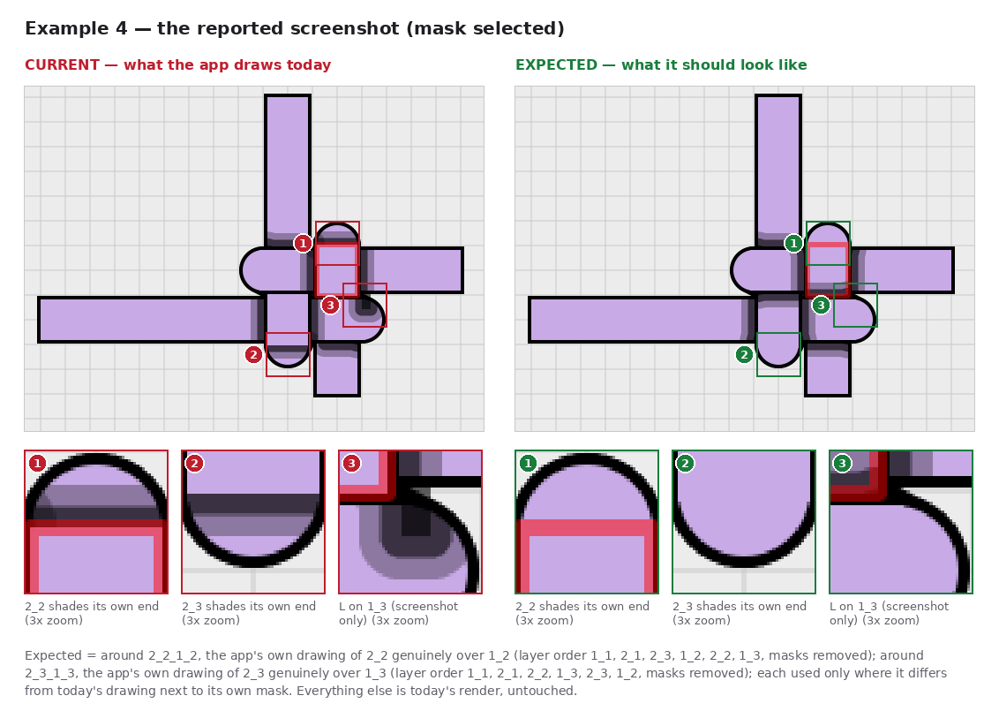
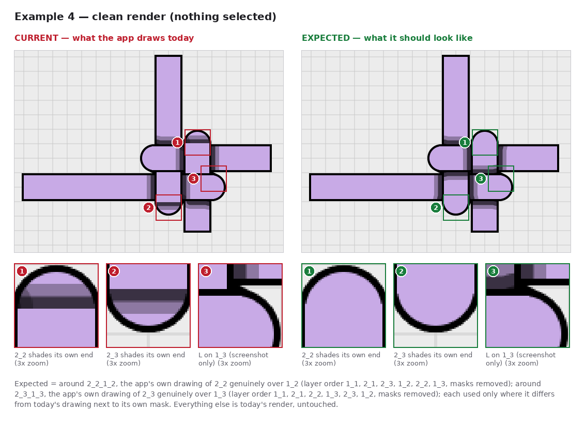
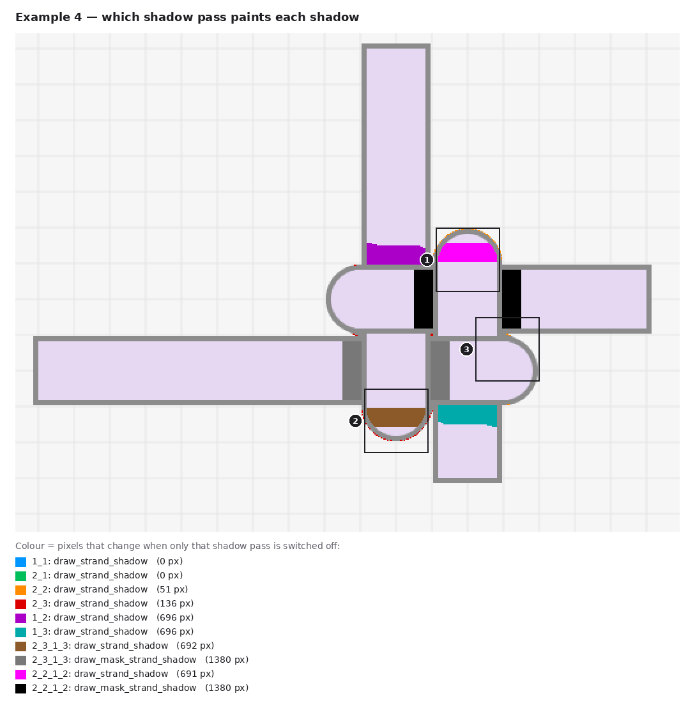

# Example 4: two masks weaving 2_2 and 2_3 through 1_2 and 1_3

**Status: fixed.** The app now draws [`expected.png`](expected.png) exactly (see [the fix](../README.md#the-fix)).
The images below show the app before the fix.

A small 2×2 weave. Set 1 is a short diagonal 1_1 with 1_2 attached at its start (running right) and 1_3 at its
end (running left). Set 2 is a short diagonal 2_1 with 2_3 attached at its start (running up) and 2_2 at its end
(running down). The two diagonals sit at the bottom of the stack and are completely covered. The four arms
weave like a checkerboard:

| | 1_2 (top row) | 1_3 (bottom row) |
|---|---|---|
| **2_3** (left column) | 1_2 over 2_3 (layer order) | **2_3 over 1_3** (mask `2_3_1_3`) |
| **2_2** (right column) | **2_2 over 1_2** (mask `2_2_1_2`) | 1_3 over 2_2 (layer order) |

A checkerboard is a loop (2_2 > 1_2 > 2_3 > 1_3 > 2_2), so no layer order can draw it, and two masks are needed.

Reported layer state:

| | |
|---|---|
| Order | `1_1, 2_1, 2_2, 2_3, 1_2, 1_3, 2_3_1_3, 2_2_1_2` |
| Connections | 1_1 start ↔ 1_2, 1_1 end ↔ 1_3; 2_1 start ↔ 2_3, 2_1 end ↔ 2_2 |
| Masked layers | `2_2_1_2` (2_2 over 1_2), `2_3_1_3` (2_3 over 1_3) |
| Positions | 1_1 (1400,448)→(1512,504) · 1_2 (1400,448)→(1624,448) · 1_3 (1512,504)→(1148,504) · 2_1 (1428,532)→(1484,420) · 2_2 (1484,420)→(1484,588) · 2_3 (1428,532)→(1428,252) |
| Shadow settings | Shadow on, NumSteps 2, MaxBlurRadius 30, color 0,0,0,150; width 46, stroke 4; "default" theme (canvas #ECECEC) |
| Shadow overrides | 1_2 → 1_1, 1_2 → 2_1, 1_3 → 1_1 and 1_3 → 2_1 hidden. The app adds these by itself when the masks are created (`src/auto_shadow.py`): the diagonals are buried under the weave. |

[`scene.json`](scene.json) rebuilds this state (open it with **Load**). Rendered headless with mask `2_2_1_2`
selected (the red outline in the screenshot), it differs from the reported screenshot in 847 of 202,800
compared pixels, all of them in one L-shaped shadow on 1_3's rounded end that the rebuilt scene does not draw
(see 3 below). The hidden shadows only touch anti-aliasing on 1_1's rounded ends, but without them 75 more
pixels differ from the screenshot, so the reporter's scene had them too.

## Screenshot vs expected



Full canvas crop: [`user_screenshot.png`](user_screenshot.png) (as reported) and
[`user_screenshot_expected.png`](user_screenshot_expected.png).

The same comparison without the selection outline:



## Observations

| # | Where | Current | Expected (user experience) |
|---|---|---|---|
| ✓ | On 1_2 on both sides of 2_2, and on 1_3 on both sides of 2_3 | Each mask's soft shadow bands | Correct along their length; only their ends at the corners differ (4) |
| 1 | 2_2's rounded end, just above 1_2 | A dark band across it: mask `2_2_1_2` casts its shadow onto 2_2 itself (691 px) | Clean. Nothing lies above 2_2 there. |
| 2 | 2_3's rounded end, just below 1_3 | The same: mask `2_3_1_3` shades 2_3 (692 px) | Clean |
| 3 | 1_3's rounded end, right of 2_2 (**screenshot only**) | An L-shaped shadow with a dark core (847 px) | Clean. 1_3 lies over 2_2 here, so nothing from 2_2's mask may darken it. |
| 4 | Where the masks meet the edges of 1_2 and 1_3 | 1_2's shadow on 2_3 is rounded off next to mask `2_2_1_2`, and the shading band on 1_2 has a dark rounded top corner (mirrored at the other mask) | Straight bands that meet at clean corners, as at a genuine crossing |
| 5 | The lifted pieces, along 1_3's top edge (2_2's piece) and 1_2's bottom edge (2_3's piece) | Plain: the mask paints its piece over the shadow 1_3 casts on 2_2 there (and 1_2 on 2_3) | 1_3's soft shadow band runs along the bottom of 2_2's piece, as at a genuine crossing, where 1_3 lies above 2_2; likewise 1_2's band along the top of 2_3's piece |

Put simply: each mask's own shading is right, but each mask also shades the strand it belongs to (1, 2),
dents the shadows next to it (4), and covers the shadow the neighbouring strand casts on it (5).

## Why



1. **A mask shades its own top strand (1, 2).** Inside `draw_strand_shadow`, a mask is an ordinary caster.
   Pairs of *component* strands skip each other (`part_of_same_visible_mask`, `src/shader_utils.py:649`–`664`),
   but the mask itself is not a component, so it casts onto 2_2 like onto any strand below it.
   - The mask's outline runs from y 419 to 477, 2 px past 1_2's outline (421 to 475) on each side.
   - Removing the strands in between (2_3, 1_2, 1_3 and the other mask) therefore still leaves two thin
     slivers along 1_2's edges.
   - Their blurred edge is stroked onto 2_2, clipped only to 2_2's outline, and that lands on 2_2's rounded
     end: 691 px (magenta, `2_2_1_2: draw_strand_shadow`). Mask `2_3_1_3` does the same to 2_3 (692 px, brown).
2. **The corners (4)** are partly the mask shadow blocker again, as in example 1: at mask `2_2_1_2`'s upper-left
   corner, switching `get_shadow_blocker_path` off removes 43 of the 116 pixels that differ from the expected
   image. The rest comes from the other passes meeting at that corner.
3. **The L on 1_3 (3) is not reproduced by this layer state.** Only the two masks lie above 1_3. Mask
   `2_2_1_2`'s outline touches 1_3's outline along one edge but does not overlap it, so it casts nothing onto 1_3,
   and mask `2_3_1_3` is too far away for its blur to reach. Nudging 1_2, 1_3 or 2_2 by up to
   half a pixel does not bring it back either. It is probably state from the editing session that the layer
   state does not carry. It is wrong in any case, so the expected screenshot is clean there
   (`screenshot_unreproduced` in [`example.json`](example.json)). A saved project file of this scene would show
   whether reloading keeps it.

## How "expected" was made

No single layer order draws a checkerboard, so each mask gets its own reference, rendered with the masks removed
(the shadow overrides stay):

- around `2_2_1_2`: order `1_1, 2_1, 2_3, 1_2, 2_2, 1_3` ([`reference_2_2_1_2.png`](reference_2_2_1_2.png)), which
  is right for every crossing except 2_3/1_3;
- around `2_3_1_3`: order `1_1, 2_1, 2_2, 1_3, 2_3, 1_2` ([`reference_2_3_1_3.png`](reference_2_3_1_3.png)), which
  is right for every crossing except 2_2/1_2.

Each reference is used only next to its own mask, and the crossing it gets wrong is a keep zone (the other mask's
crossing). Each mask's own piece always comes from its own reference (`own_piece_px`): the pieces touch the other
mask's keep zone, and without that rule the band of observation 5 was left out. [`capture_report.json`](capture_report.json)
lists the transplanted pieces: 1,485 and 1,484 pixels for the two masks, 636 of each on the rounded end.

Regenerate everything in this folder:

```
QT_QPA_PLATFORM=offscreen python automation_tests/capture_mask_shadow_observations.py docs/mask_shadow_observations/example_04_two_masks_weave
```
