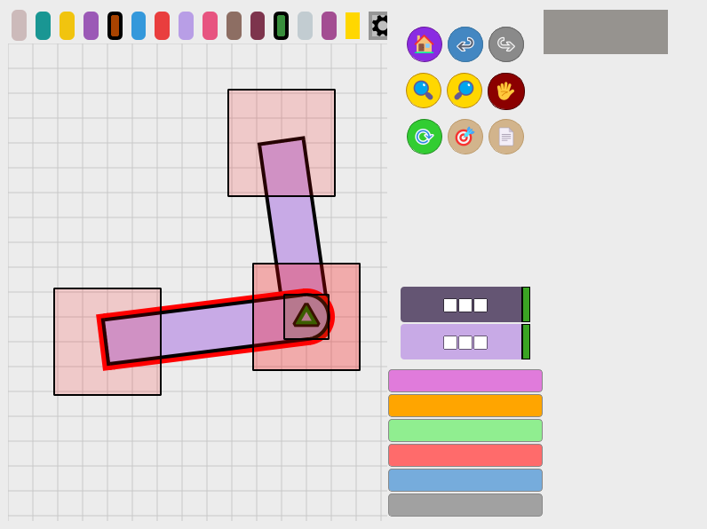
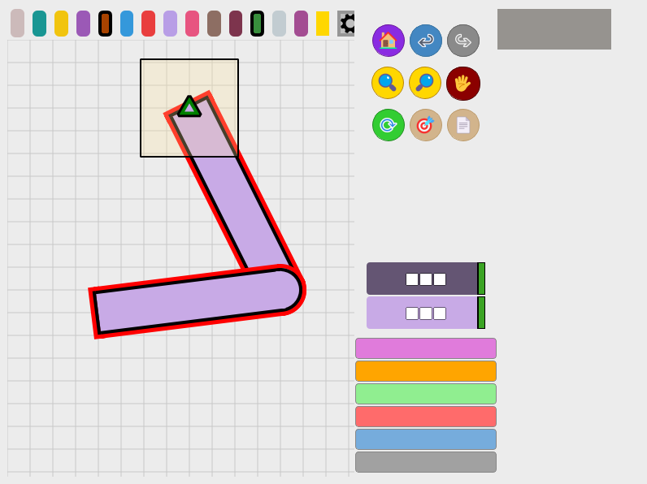
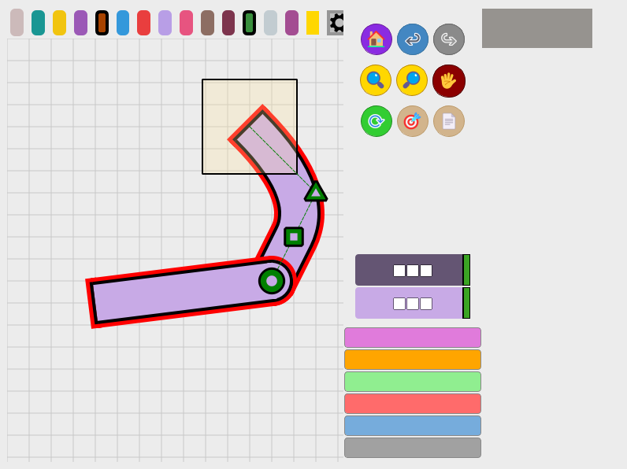

# Issue: never-moved start control point appears while dragging a strand in move mode

> **Status: FIXED** (2026-07-13). The change below is applied in
> `src/strand_drawing_canvas.py` (`_draw_control_points_impl`, normal drawing
> branch; the duplicated assignment block was also deduplicated). The
> regression test passes 9/9.

## Summary

With **"Show control points only for the selected strand"** enabled, a strand
that is *not* the selected strand shows no control points — as expected. But
the moment you grab that strand's **start point** and drag it in move mode,
its start control point (the green triangle) pops into view riding the
dragged point, **even though the strand's control points were never moved**.

Reported scenario: `1_2` is the selected strand, the user drags `1_1`'s start
point. `1_1`'s control points were never touched (`triangle_has_moved =
False`), yet the triangle is drawn inside the yellow selection square.

## Settings that produce the issue ("case #5")

| Settings dialog option | Internal name | Value |
|---|---|---|
| Show control points only for the selected strand | `show_cp_selected_only` | **on** |
| In move mode, allow only to move the selected strand | `move_selected_only` | off |
| Draw only affected strand when dragging | `draw_only_affected_strand` | off |
| Enable third control point | `enable_third_control_point` | on |

(The toolbar "show control points" toggle is on.)

## Reproduction

1. Two connected strands `1_1` → `1_2`; `1_1`'s control points never moved.
2. Select `1_2` (its start triangle shows; `1_1` shows nothing — correct).
3. Switch to move mode, grab `1_1`'s **start point** and drag.
4. **Bug:** `1_1`'s green start triangle is drawn at the dragged point.

### Before the drag — filter works correctly

`1_2` is selected and shows its start triangle (green callout); `1_1` shows
no control points:



### During the drag — the bug

Dragging `1_1`'s start point: the never-moved triangle is drawn inside the
yellow selection square (red callout):



### Expected

Same frame, no control point — the curve of `1_1` was never shaped, so there
is no handle to show (green callout marks the empty spot):


### Behavior that must keep working

If the strand's curve **was** shaped (`triangle_has_moved = True`), its
handles must stay visible while dragging an endpoint:



## Root cause — the full chain

Control point drawing happens in
`StrandDrawingCanvas._draw_control_points_impl` (`src/strand_drawing_canvas.py`).
Four pieces combine:

1. **Grabbing a strand selects it.** The move-mode mouse press makes the
   dragged strand the canvas selection as a side effect —
   `src/move_mode.py:1411-1417`:

   ```python
   self.temp_selected_strand = self.affected_strand
   if self.temp_selected_strand and not self.is_moving_control_point and not self.user_deselected_all:
       ...
       self.canvas.selected_attached_strand = self.temp_selected_strand
   ```

   So mid-drag, `1_1` *is* "the selected strand" even though the user selected
   `1_2`. (Even when this assignment is skipped, the fallback in
   `is_strand_in_selected_family`, `src/strand_drawing_canvas.py:5964-5967`,
   resolves to `MoveMode.affected_strand` during a drag.)

2. **The family filter therefore passes it.**
   `src/strand_drawing_canvas.py:6064-6066` hides control points of every
   strand except the selected one — but per (1), the dragged strand now *is*
   the selected one.

3. **The during-drag skip logic explicitly allows the affected strand.**
   `src/strand_drawing_canvas.py:6068-6073`:

   ```python
   should_skip = not (is_affected or allowed_by_draw_only)
   ```

4. **The triangle has no "was it ever moved" gate.** In the normal drawing
   branch, `triangle_has_moved` gates the circle (cp2), the center square,
   and the guide lines — but the triangle (cp1) is drawn unconditionally,
   `src/strand_drawing_canvas.py:6311-6320`:

   ```python
   show_circle_cp = triangle_has_moved and show_small_cps
   show_triangle_cp = True  # Always show triangle when control points are enabled
   ```

Finally, the triangle appears *at the dragged point itself* because a
never-moved `control_point1` coincides with the start and is carried along by
the `start` setter (`src/strand.py:441-444`).

## The fix — exact code to change

**File:** `src/strand_drawing_canvas.py`, method `_draw_control_points_impl`,
in the **normal drawing branch**. The flag `moving_strand_point` (true while
an endpoint is being dragged) is already computed at the top of the method
(line 6022).

Replace the unconditional triangle with one gated on "endpoint drag of a
never-shaped curve". Note the assignment block is **duplicated twice in a
row** (lines ~6303-6313 and ~6315-6320) — change both, or remove the
duplicate:

```python
# BEFORE (lines ~6311-6313, duplicated again at ~6318-6320)
show_circle_cp = triangle_has_moved and show_small_cps
show_triangle_cp = True  # Always show triangle when control points are enabled

# AFTER
show_circle_cp = triangle_has_moved and show_small_cps
# Hide a never-moved triangle while an endpoint is being dragged:
# it only appears there because the drag made this strand "selected".
show_triangle_cp = not (moving_strand_point and not triangle_has_moved)
```

Why this location and nothing else:

- **The supersampled path needs no change** —
  `_draw_control_points_supersampled` (line 5929) delegates to
  `_draw_control_points_impl`.
- **The "draw only affected" branch (line ~6098) needs no change** — it only
  runs while dragging a *control point*, and grabbing the triangle sets
  `triangle_has_moved = True` first (`src/move_mode.py:2058`), so a
  never-moved triangle can't reach it.
- **Do not "fix" this in the selection assignment** (`move_mode.py:1411-1417`)
  or the family-filter fallback (`strand_drawing_canvas.py:5964-5967`) —
  highlighting, connected-strand movement, and handle visibility for shaped
  curves all depend on the dragged strand counting as selected.
- **Do not touch the `start` setters** (`strand.py` / `attached_strand.py`) —
  carrying an unmoved control point along with the start is intended
  geometry behavior; the issue is purely which markers get *drawn*.

What stays correct after the fix:

- Idle + selected: the triangle still shows (needed to grab it the first
  time and shape the curve).
- Dragging a strand whose curve was shaped: handles stay visible
  (screenshot 04).
- All eight combinations of the three settings keep their current behavior
  for non-dragged strands (their CPs are always hidden during a drag).

All four screenshots above are real captures of the running application
(same bootstrap as `src/main.py`), taken mid-drag with the mouse button held.
The bug frame (02) was captured with the fix temporarily reverted.

## Tests

The regression test lives in `tests/control_points/`, the screenshot
capture in `automation_tests/` — both run standalone (offscreen — no
window opens):

- **`test_cp_visibility_during_drag.py`** — regression test that renders the
  real `draw_control_points()` pipeline and asserts visibility per scenario.
  Before the fix it reported 8 passed / 1 failed, the failing check being
  this bug:

  ```
  [FAIL] drag 1_1 start (1_2 was selected): 1_1's never-moved start triangle stays hidden
         ::  green triangle rendered at the dragged start point (cp1=400,100)
  ```

  With the fix applied, all **9 checks pass** — including the two guard
  checks ("idle, 1_2 selected: 1_2 triangle shown" and "drag with shaped
  curve: triangle IS shown") that prevent over-hiding.

- **`automation_tests/capture_cp_drag_screens.py`** — regenerates the PNGs in
  `src/documentation/images/cp_drag/` by launching the real app, drawing
  `1_1`, attaching `1_2` with real mouse events, selecting `1_2`, and
  grabbing the window mid-drag. Add `--visible` to watch it happen.

```
python tests\control_points\test_cp_visibility_during_drag.py
python automation_tests\capture_cp_drag_screens.py --mode fixed
# for the bug frame (02), run with the fix reverted:
#   git stash push -- src/strand_drawing_canvas.py
#   python automation_tests\capture_cp_drag_screens.py --mode bug
#   git stash pop
```
