# Selection Silhouette Border Fix

This package documents the July 2026 selection-overlay correction and provides loadable OpenStrand Studio examples for endpoint side-line and circle visibility.

The source was `C:\Users\YonatanSetbon\Downloads\masknotworkingexample.json`, an `OpenStrandStudioHistory` export. The generator extracted its current state, step 18, into a normal six-layer snapshot before producing the variants. The source file is not required to load any JSON under [`samples/`](samples/).

For a visual, browser-friendly version of this document, open [`index.html`](index.html).

## Requested behavior

When a strand is hovered or selected, the colored overlay must be treated as one silhouette:

- The border follows only the outside perimeter.
- Overlapping body, circle, cap, and side-line components do not create lines inside the overlay.
- Endpoint decorations remain part of the filled highlight and hit area.
- The change is visual only; it does not remove real strand geometry or reduce selection accuracy.

## Before and after

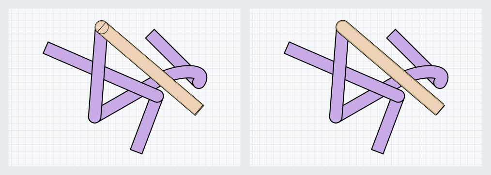

On the left, the old direct pen outlines every subpath and exposes the rounded start-cap seam inside yellow layer `1_4`. On the right, the same JSON and same hovered layer produce one external border.

## Why the bug happened

A normal strand selection footprint is composite geometry:

1. A stroked body path.
2. A start endpoint decoration.
3. An end endpoint decoration.

These components overlap. Drawing the composite path with `QPainter.drawPath()` and a pen tells Qt to stroke every component boundary, including boundaries that are inside the combined filled area.

The obvious alternative—Boolean-unioning the components—cannot safely be used here. Qt can discard an angled strand body when a thin side-line band touches the body boundary exactly. That was the original selection failure in `masknotworkingexample.json`.

The corrected renderer keeps the robust component-based footprint, creates a wider stroke around it, and subtracts the filled footprint from that stroke. The remainder is only the external ring. Fill and ring are painted separately.

Relevant implementation:

- [`selection_outline_path()`](../../selection_utils.py) builds the external ring.
- [`draw_selection_overlay()`](../../selection_utils.py) paints fill and ring separately.
- [`SelectMode.draw()`](../../select_mode.py) uses the helper for yellow hover feedback.
- [`MaskMode.draw()`](../../mask_mode.py) uses the same helper for hover and mask selection feedback.

## Selection targets across all source layers

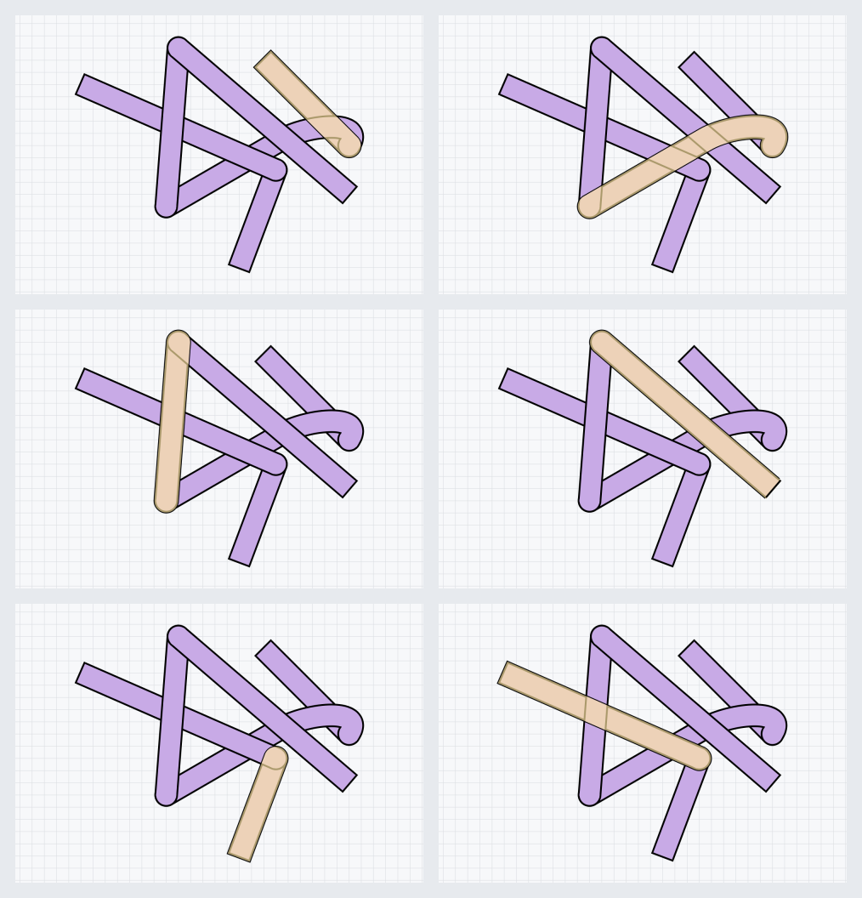

The same reference JSON is rendered six times so each source strand is independently verified:

- [`1_1`](screenshots/selection_target_1_1.png) — regular diagonal strand.
- [`1_2`](screenshots/selection_target_1_2.png) — curved attached strand with endpoint caps.
- [`1_3`](screenshots/selection_target_1_3.png) — vertical attached strand.
- [`1_4`](screenshots/selection_target_1_4.png) — diagonal attached strand from the original report.
- [`2_1`](screenshots/selection_target_2_1.png) — regular lower strand.
- [`2_2`](screenshots/selection_target_2_2.png) — attached crossing strand.

The visibility examples below also rotate their highlighted target rather than repeatedly using `1_4`.

## Complete example set

All files are ordinary project snapshots and can be opened directly with the application’s **Load** button.

| # | Sample | Hovered | What it demonstrates |
|---:|---|---|---|
| 00 | [`00_reference.json`](samples/00_reference.json) | `1_4` | Exact current snapshot extracted from history step 18. |
| 01 | [`01_side_lines_visible.json`](samples/01_side_lines_visible.json) | `1_1` | Circle flags are disabled and all supported start/end side lines are visible. |
| 02 | [`02_start_side_lines_hidden.json`](samples/02_start_side_lines_hidden.json) | `2_1` | All `start_line_visible` flags are `false`; end side lines remain enabled. |
| 03 | [`03_end_side_lines_hidden.json`](samples/03_end_side_lines_hidden.json) | `2_2` | All `end_line_visible` flags are `false`; start side lines remain enabled. |
| 04 | [`04_all_side_lines_hidden.json`](samples/04_all_side_lines_hidden.json) | `1_3` | Both side-line flags are disabled on every layer. |
| 05 | [`05_circles_visible.json`](samples/05_circles_visible.json) | `1_2` | Start and end circles are explicitly enabled; side lines are disabled. |
| 06 | [`06_start_circles_hidden.json`](samples/06_start_circles_hidden.json) | `2_1` | Start circles are explicitly hidden; end circles remain visible. |
| 07 | [`07_end_circles_hidden.json`](samples/07_end_circles_hidden.json) | `1_3` | End circles are explicitly hidden; start circles remain visible. |
| 08 | [`08_all_circles_hidden.json`](samples/08_all_circles_hidden.json) | `2_2` | Both endpoint circle flags are explicitly disabled. |
| 09 | [`09_transparent_circle_outlines.json`](samples/09_transparent_circle_outlines.json) | `1_2` | Circle geometry remains enabled, but start/end circle stroke alpha is zero. |
| 10 | [`10_mixed_visibility.json`](samples/10_mixed_visibility.json) | `1_1` | Per-layer mixture of hidden side lines, hidden circles, and a transparent circle outline. |
| 11 | [`11_complex_24_layers.json`](samples/11_complex_24_layers.json) | `7_4` | A 24-layer radial weave made from four rotated copies of the source motif. |

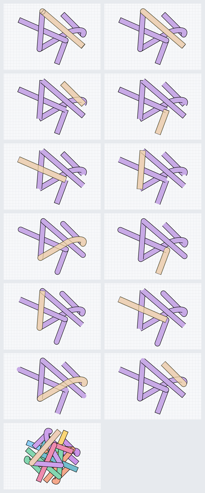

## Side-line examples

Side-line visibility only affects an endpoint when a circle is not occupying that endpoint. Attached-strand starts are attachment caps and do not draw a normal start side line, even if `start_line_visible` is true. The control sample disables circles so the valid side-line positions are easy to compare.

### All supported side lines visible

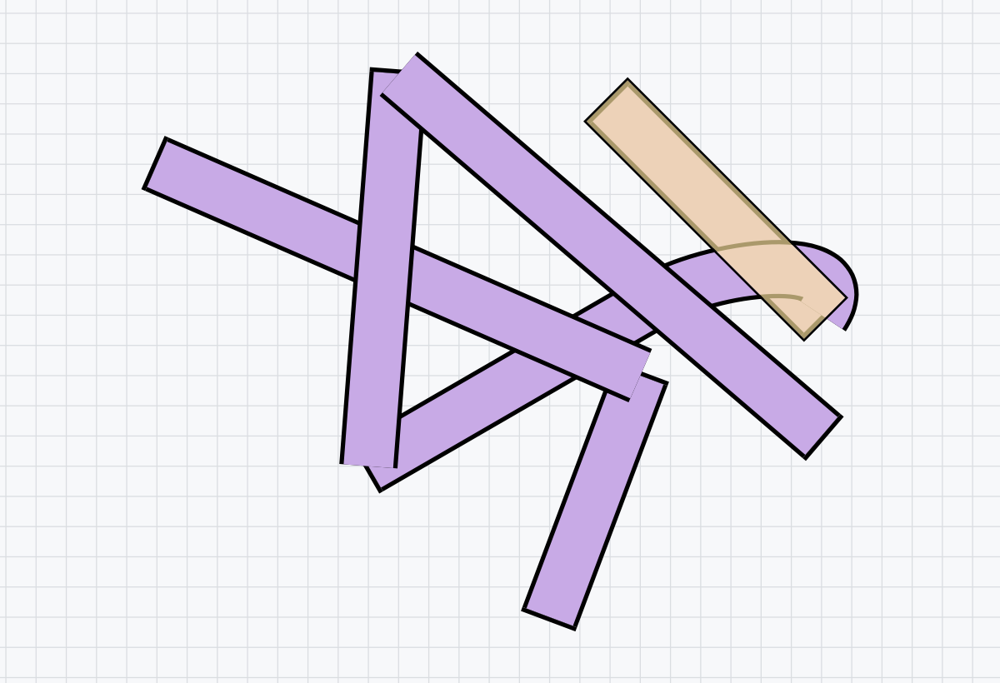

### Start side lines hidden


### End side lines hidden

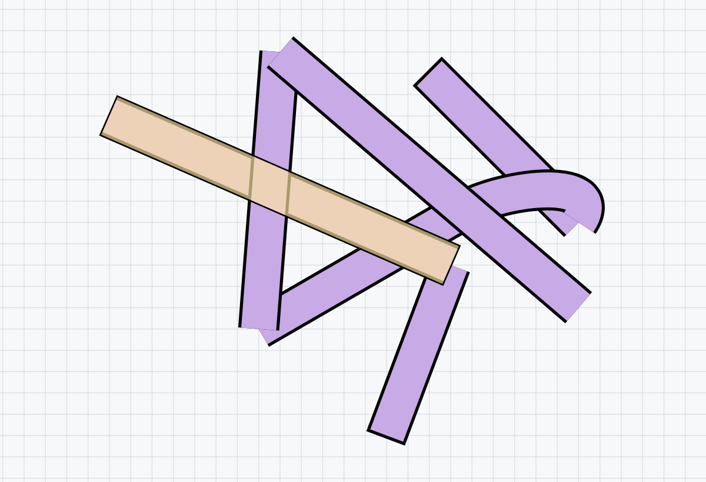

### All side lines hidden

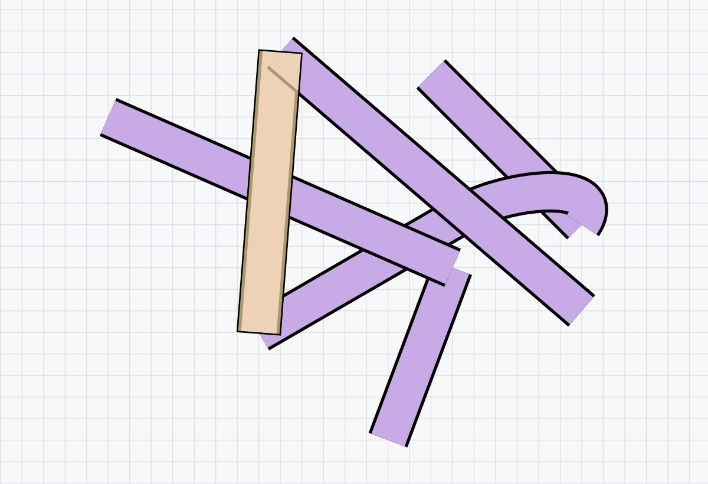

## Circle examples

Circle visibility is affected by attachment topology. During load, OpenStrand Studio reconstructs the default circle state from parent/child relationships. Therefore these samples store `manual_circle_visibility` alongside `has_circles`; this is the same override used by the layer menu and ensures an explicit choice survives topology validation.

### All endpoint circles visible

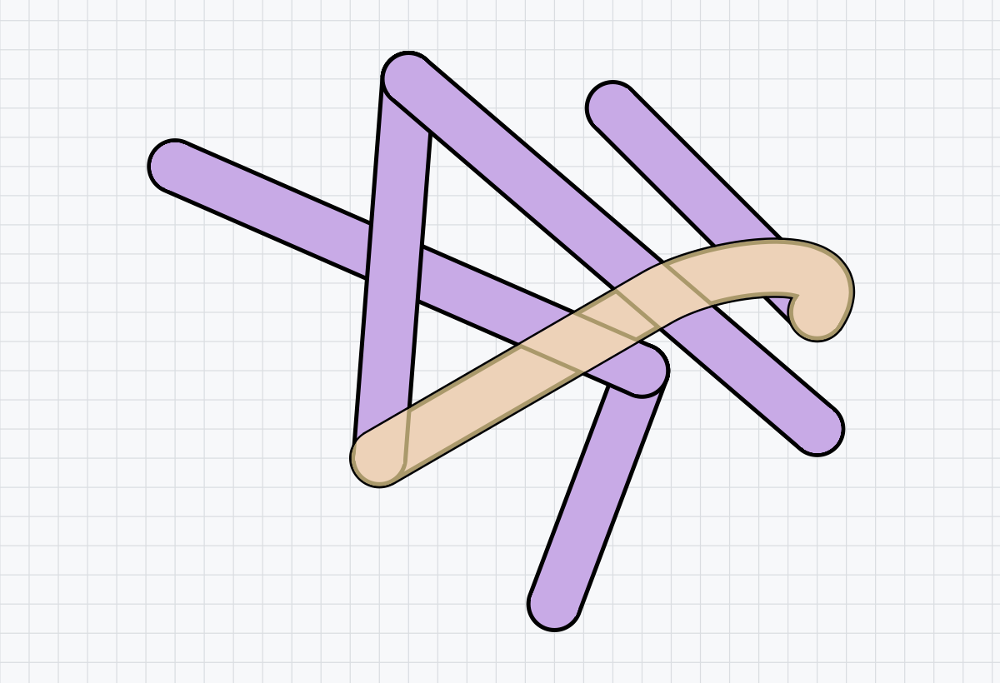

### Start circles hidden

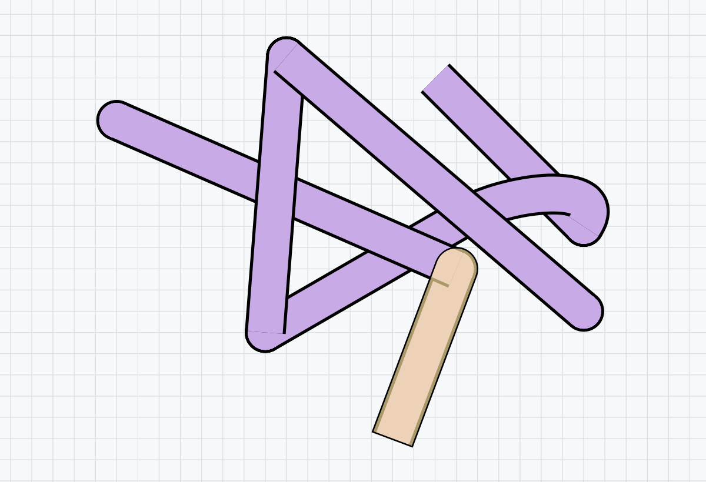

### End circles hidden

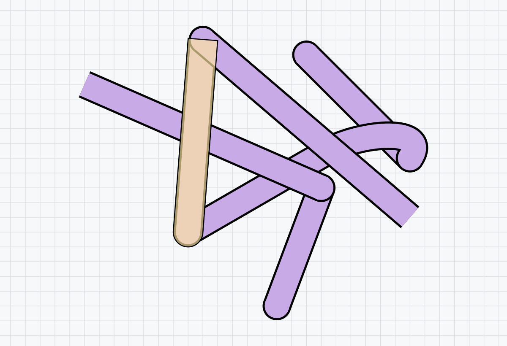

### All circles hidden


### Circle outlines transparent

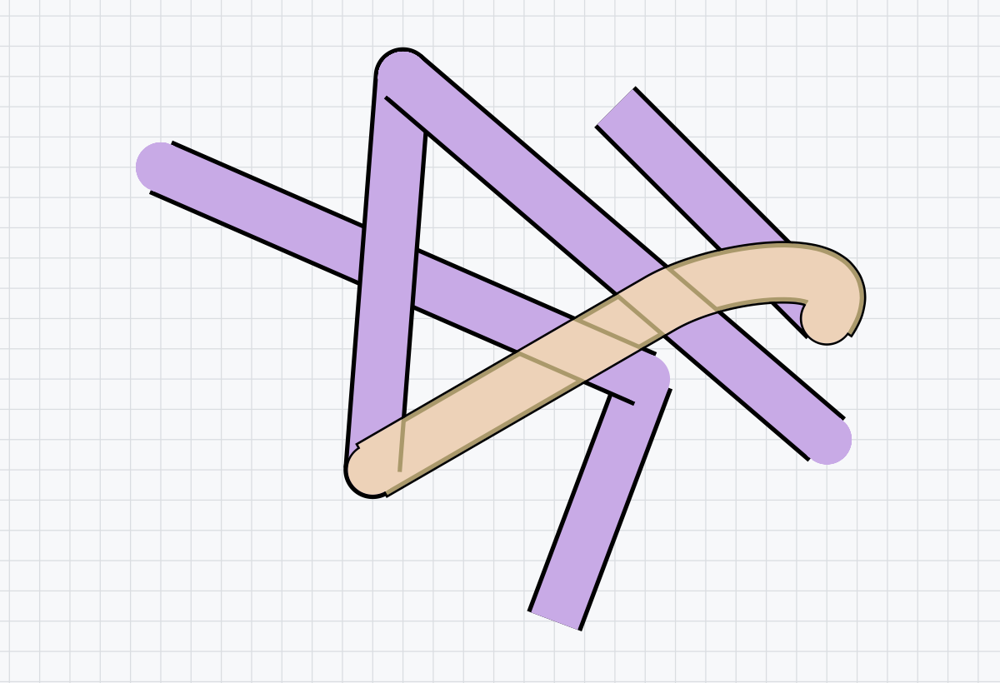

Setting a circle stroke color’s alpha to zero differs from setting `has_circles` to `false`. The former keeps circle/cap geometry and suppresses its outline; the latter disables the circle decoration itself.

The selected curved layer `1_2` demonstrates the transparent-endpoint correction: its visible inner cap fills are included in the selection footprint even though their stroke rings are invisible.

### Mixed visibility

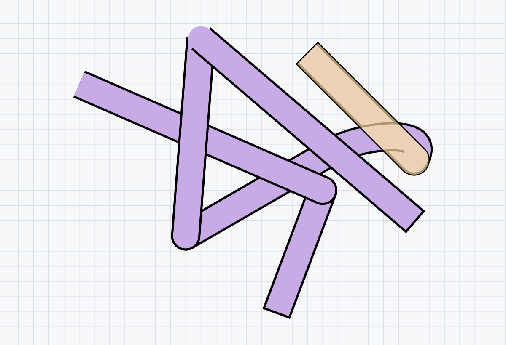

## Complex 24-layer sample

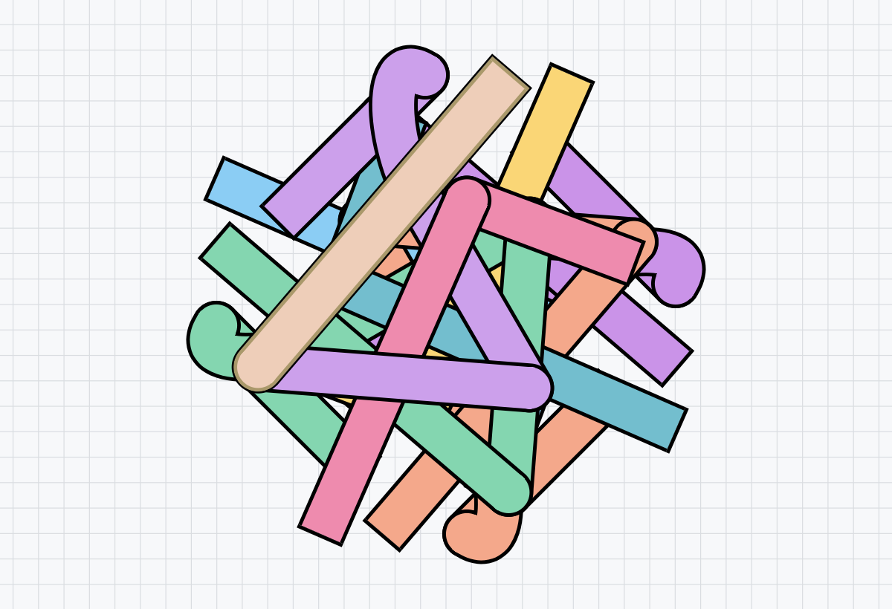

The complex sample contains 24 layers across eight strand sets. It is built from four rotated and recolored copies of the source six-layer motif, preserving each copy’s attachment chains and control points. Hovered layer `7_4` demonstrates that the corrected border remains a single silhouette in a dense composition.

## JSON property reference

| Property | Type | Meaning |
|---|---|---|
| `start_line_visible` | Boolean | Allows the start side line when that strand type and endpoint geometry support it. |
| `end_line_visible` | Boolean | Allows the end side line when no end circle replaces it. |
| `has_circles` | Two Booleans | Requested start/end circle geometry. Attachment validation may reconstruct defaults. |
| `manual_circle_visibility` | Two Boolean/null values | Explicit per-end override. `null` follows topology; `true`/`false` persists the user choice. |
| `start_circle_stroke_color.a` | 0–255 | Start circle outline opacity. Zero makes the outline transparent. |
| `end_circle_stroke_color.a` | 0–255 | End circle outline opacity. Zero makes the outline transparent. |
| `closed_connections` | Two Booleans | Marks endpoint cap geometry as a closed connection where applicable. |

## Regenerating the package

The screenshots are rendered with the actual loader, strand drawing code, and corrected `SelectMode` overlay—not a diagram approximation.

From the repository root in PowerShell:

```powershell
$env:QT_QPA_PLATFORM = "offscreen"
python src\documentation\selection_outline_examples\generate_examples.py `
  "C:\Users\YonatanSetbon\Downloads\masknotworkingexample.json"
```

The generator creates all JSON snapshots, individual PNG screenshots, the six-target selection gallery, the before/after comparison, and the contact sheets. Pass another history export or normal project snapshot as the first argument to rebuild the set from a different source.

## Validation checklist

- Reference JSON loads as six layers: passed.
- Complex JSON loads as 24 layers: passed.
- Every sample has unique rendered output: passed.
- Yellow overlay has no internal endpoint seam: passed.
- Selection footprint still contains body and endpoint decorations: passed.
- Selection regression suite: 63 checks passed, 0 failed.
